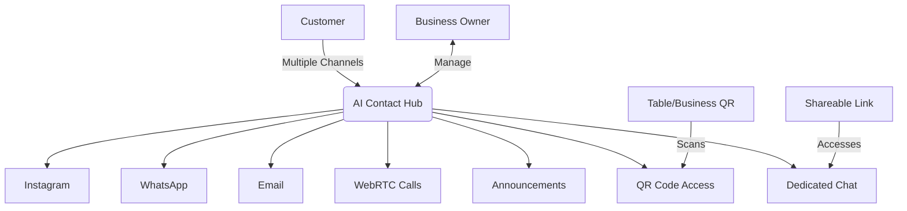
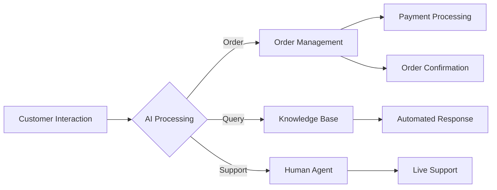

# 🤖 AI Contact System - X-sevenAI

*Last Updated: October 2025*  
*Version: 2.0*

---

## 🌐 Overview
X-sevenAI's AI Contact System revolutionizes how businesses communicate with customers through intelligent, automated interactions across multiple channels. This unified platform combines AI-powered messaging, calling, and announcements to deliver seamless customer experiences.

---

## 📱 AI-Powered WhatsApp Integration

### Why You Need It
- **24/7 Customer Support**: Never miss a message or order
- **Automated Order Processing**: Handle high volumes without additional staff
- **Personalized Interactions**: AI remembers customer preferences and order history

### How It Works
1. **Message Reception**: AI analyzes incoming messages in real-time
2. **Intent Recognition**: Identifies if it's an order, query, or support request
3. **Automated Response**: Provides instant, relevant responses
4. **Human Handoff**: Escalates complex issues to your team

### Getting Started
1. Connect your WhatsApp Business account in the dashboard
2. Train the AI with your menu/services
3. Set up automated responses and workflows
4. Monitor conversations through the unified inbox

---

## 📸 Instagram Messaging & Ordering

### Why You Need It
- **Direct Sales Channel**: Convert DMs into orders
- **Visual Commerce**: Customers can order directly from your posts
- **Brand Engagement**: Build stronger relationships through social media

### How It Works
1. **Direct Message Processing**: AI handles DMs and comments
2. **Visual Recognition**: Identifies products from images
3. **Order Management**: Processes orders directly in chat
4. **Payment Integration**: Secure checkout within Instagram

### Getting Started
1. Connect your Instagram Business account
2. Upload your product catalog
3. Set up automated responses for common queries
4. Enable Instagram Shopping features

---

## 📧 Smart Email Campaigns

### Why You Need It
- **Targeted Marketing**: Reach the right customers with personalized content
- **Automated Workflows**: Set up once, run continuously
- **Performance Tracking**: Measure ROI with detailed analytics

### How It Works
1. **Audience Segmentation**: Automatically groups customers
2. **AI Content Generation**: Creates engaging email content
3. **Scheduling & Sending**: Optimizes send times
4. **Analytics**: Tracks opens, clicks, and conversions

### Getting Started
1. Import your contact list
2. Choose a campaign template
3. Customize with AI assistance
4. Schedule and send

---

## 🔳 QR Code & Dedicated Chat Access

### Why You Need It
- **Instant Access**: Customers can instantly connect via QR codes on tables, menus, or business cards
- **Context-Aware**: Each QR code contains business/table ID for personalized service
- **Shareable Links**: Generate unique links for specific services or promotions
- **Contactless Service**: Perfect for restaurants, salons, and retail environments

### How It Works
1. **QR Code Generation**: 
   - Create unique QR codes for different contexts (tables, services, locations)
   - Each code embeds business/table ID and context
   
2. **Customer Experience**:
   - Customer scans QR code with phone camera
   - Opens dedicated chat interface pre-contextualized to location/service
   - Seamless ordering, support, or information access

3. **Shareable Links**:
   - Generate custom links for specific services or promotions
   - Share via email, social media, or messaging apps
   - Track engagement and conversions per link

### Getting Started
1. **For Businesses**:
   - Go to 'QR Codes' in your dashboard
   - Select template (Table, Menu, Service, etc.)
   - Customize with your branding
   - Download and print QR codes
   
2. **For Customers**:
   - Scan QR code with phone camera
   - No app download required - works in mobile browser
   - Start chatting with AI assistant immediately

### Use Cases
- **Restaurants**: Table ordering, menu access, bill payment
- **Retail**: Product information, stock checks, checkout
- **Services**: Booking, support, information lookup
- **Events**: Information, schedules, networking

## 📞 WebRTC Calling with AI Assistant

### Why You Need It
- **24/7 Availability**: AI handles calls outside business hours
- **Multilingual Support**: Serve customers in their preferred language
- **Call Analytics**: Gain insights from call data

### How It Works
1. **Call Reception**: AI answers with a natural voice
2. **Speech Recognition**: Converts speech to text
3. **Intent Analysis**: Understands customer needs
4. **Action**: Books, orders, or escalates as needed

### Getting Started
1. Get your business phone number
2. Set up call flows in the dashboard
3. Customize AI voice and responses
4. Add the call widget to your website

---

## 📢 One-Click Announcements

### Why You Need It
- **Instant Communication**: Reach customers immediately
- **Multi-channel Reach**: Send once, publish everywhere
- **Performance Tracking**: See what works best

### How It Works
1. **Create**: Write your message or use AI suggestions
2. **Select Channels**: Choose where to publish
3. **Target**: Select audience segments
4. **Send/Schedule**: Immediate or scheduled delivery

### Getting Started
1. Go to Announcements in your dashboard
2. Click "New Announcement"
3. Use templates or create from scratch
4. Select channels and audience
5. Send or schedule

---

## 🔄 Integration & Workflow

## 📊 Performance Dashboard
- Real-time analytics for all channels
- Customer satisfaction scores
- Response time tracking
- Conversion rates
- ROI calculation

## 🔒 Security & Compliance
- End-to-end encryption
- GDPR & CCPA compliant
- Secure payment processing
- Data backup & recovery

---

## 🚀 Getting Started Guide
1. **Set Up**: Connect your business accounts
2. **Train AI**: Upload menus, FAQs, and business info
3. **Customize**: Tailor responses and workflows
4. **Go Live**: Start engaging with customers
5. **Optimize**: Use analytics to improve performance

## 📞 Support
Need help? Contact our 24/7 support team through the dashboard or email support@xsevenai.com

---

*© 2025 X-sevenAI. All rights reserved.*
