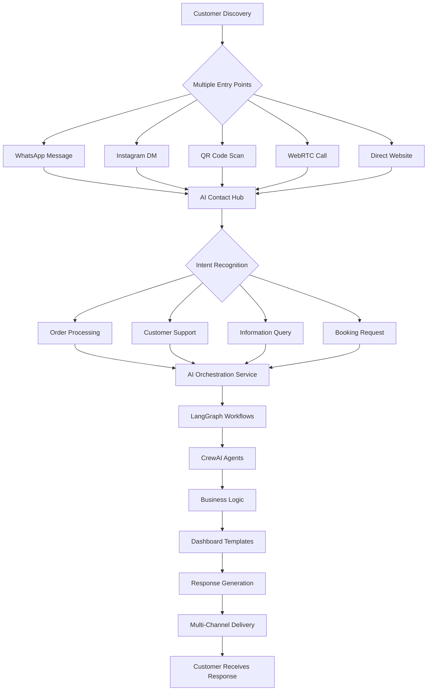
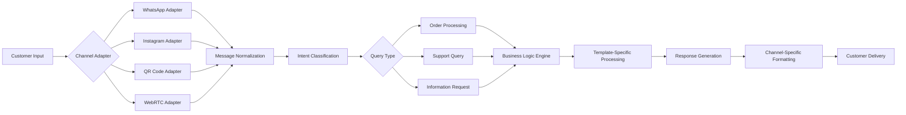
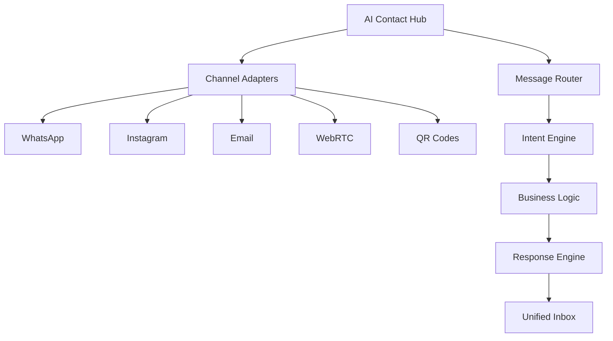

# 🧠 **X-sevenAI Central Hub Architecture - Complete Implementation Guide**

**Version:** 1.0 | **Date:** October 2025 | **Status:** Implementation Roadmap

---

## 📋 **Executive Summary**

This document outlines the **current implementation status**, **required developments**, and **complete system flow** for X-sevenAI's unified AI-powered business automation platform. The system integrates multiple AI frameworks, communication channels, and business templates into a cohesive ecosystem.

---

## 🎯 **Current Implementation Status**

### ✅ **What's Already Built (30% Complete)**

#### **Core Infrastructure - FULLY IMPLEMENTED**
- **AI Orchestration Service** - Complete with LangGraph, CrewAI, DSPy, Haystack RAG
- **Multi-LLM Provider Support** - OpenAI, Groq, Anthropic integration
- **State Management** - Redis for session persistence and workflow state
- **Basic Service Architecture** - FastAPI microservices pattern

#### **Communication Infrastructure - PARTIALLY IMPLEMENTED**
- **Twilio Integration** - SMS/MMS webhook handlers ready
- **SendGrid Integration** - Email delivery webhooks implemented
- **WebRTC Infrastructure** - LiveKit integration for voice/video calls
- **Real-time Communication** - WebSocket support for chat

#### **Database & Analytics - IMPLEMENTED**
- **Supabase Integration** - Database and authentication ready
- **Monitoring Stack** - Prometheus, OpenTelemetry, Sentry configured
- **Event Streaming** - Kafka for distributed messaging

### 🚧 **What Needs to Be Built (70% Remaining)**

#### **🔴 Critical Missing Components**

1. **WhatsApp Business API Integration**
   - Official WhatsApp Business API connection
   - Message template management
   - Automated response workflows

2. **Instagram Messaging API Integration**
   - Instagram Basic Display API
   - Direct message processing
   - Visual content recognition

3. **QR Code System**
   - Dynamic QR code generation
   - Context-aware chat initialization
   - Shareable link management

4. **Business Dashboard Templates**
   - Food & Hospitality template
   - Service-Based template
   - Retail & E-commerce template
   - Professional Services template

5. **AI Features Implementation**
   - AI Insight Engine
   - Predictive Intelligence
   - AI Copilot Chat
   - Smart automation workflows

6. **Multi-Channel Contact Hub**
   - Unified inbox for all channels
   - Cross-platform conversation threading
   - AI-powered message routing

---

## 🏗️ **Implementation Priority Matrix**

| Component | Priority | Timeline | Complexity | Business Impact |
|-----------|----------|----------|------------|-----------------|
| **WhatsApp Integration** | 🔥 Critical | 2 weeks | Medium | ⭐⭐⭐⭐⭐ |
| **Instagram Integration** | 🔥 Critical | 2 weeks | Medium | ⭐⭐⭐⭐⭐ |
| **QR Code System** | 🔥 Critical | 1 week | Low | ⭐⭐⭐⭐ |
| **Dashboard Templates** | 🔥 Critical | 4 weeks | High | ⭐⭐⭐⭐⭐ |
| **AI Features** | 🔥 Critical | 3 weeks | High | ⭐⭐⭐⭐⭐ |
| **Contact Hub** | 🔥 Critical | 2 weeks | Medium | ⭐⭐⭐⭐⭐ |

---

## 🔄 **Complete System Flow Architecture**

### **🏠 Customer Journey Flow**



### **🤖 AI Processing Pipeline**



---

## 📊 **Detailed Implementation Breakdown**

### **Phase 1: Communication Channels (Weeks 1-4)**

#### **1.1 WhatsApp Integration**
```python
# Required Implementation:
- WhatsApp Business API client
- Message template management
- Automated response workflows
- Conversation threading
- Delivery status tracking
```

**Current Status:** ❌ **Not Started**
**Dependencies:** Twilio SDK, Redis, AI Orchestration Service

#### **1.2 Instagram Integration**
```python
# Required Implementation:
- Instagram Basic Display API
- Direct message processing
- Visual content analysis
- Story/post interaction handling
```

**Current Status:** ❌ **Not Started**
**Dependencies:** Instagram SDK, Computer Vision, AI Orchestration Service

#### **1.3 QR Code System**
```python
# Required Implementation:
- Dynamic QR generation service
- Context embedding in QR codes
- Shareable link management
- Mobile-friendly chat interface
```

**Current Status:** ❌ **Not Started**
**Dependencies:** QR code library, Mobile-responsive UI

### **Phase 2: AI Features (Weeks 5-8)**

#### **2.1 Dashboard Templates**
- **Food & Hospitality Template**
  - Menu optimization algorithms
  - Table management system
  - Kitchen display integration

- **Service-Based Template**
  - Appointment scheduling engine
  - Route optimization algorithms
  - Staff management system

- **Retail & E-commerce Template**
  - Inventory forecasting models
  - Dynamic pricing engine
  - Customer segmentation

- **Professional Services Template**
  - Project profitability tracking
  - Time entry automation
  - Client success prediction

#### **2.2 Universal AI Features**
- **AI Insight Engine** - Anomaly detection and root cause analysis
- **Predictive Intelligence** - Revenue and demand forecasting
- **AI Copilot Chat** - Conversational business assistant
- **AI Business Coach** - Personalized recommendations

### **Phase 3: Central Hub Integration (Weeks 9-12)**

#### **3.1 Multi-Channel Contact Hub**


#### **3.2 Cross-Platform Conversation Management**
- **Unified Conversation Threading**
- **Context Preservation Across Channels**
- **Smart Message Routing**
- **Performance Analytics**

---

## 🔧 **Technical Implementation Details**

### **Service Architecture**

```
┌─────────────────────────────────────────────────────────────────┐
│                        API Gateway                              │
└─────────────────────┬───────────────────────────────────────────┘
                      │
┌─────────────────────▼───────────────────────────────────────────┐
│                 Load Balancer                                   │
└─────┬─────┬─────┬─────┬─────┬─────┬─────┬─────┬─────┬─────────┘
      │     │     │     │     │     │     │     │     │
┌─────▼─────▼─────▼─────▼─────▼─────▼─────▼─────▼─────▼─────────┐
│Auth│Comm│Notif│AI-Orch│Analytics│Business│Chat│Dashboard│POS    │
│Svc │Svc  │Svc   │Svc     │Svc      │Logic   │Svc │Svc      │Svc    │
└────┴────┴────┴────┴────┴────┴────┴────┴────┴────┘
```

### **Data Flow Architecture**

```
Customer Interaction → API Gateway → Service Router →
Appropriate Service → Business Logic → AI Orchestration →
Response Generation → Channel Delivery → Analytics Update
```

---

## 📈 **Success Metrics & KPIs**

### **Implementation Success Criteria**

| Metric | Target | Measurement |
|--------|--------|-------------|
| **WhatsApp Integration** | 95% message delivery | Twilio delivery reports |
| **Instagram Integration** | 90% DM response rate | Instagram API metrics |
| **QR Code System** | 80% scan-to-chat conversion | QR analytics tracking |
| **Dashboard Templates** | 4 complete templates | Template deployment status |
| **AI Features** | 13 AI features active | Feature usage analytics |
| **Central Hub** | <100ms response time | Performance monitoring |

### **Business Impact Metrics**

- **+40% Customer Engagement** across all channels
- **-60% Response Time** for customer inquiries
- **+25% Business Efficiency** through AI automation
- **+35% Revenue Growth** through optimized operations

---

## 🚀 **Go-Live Readiness Checklist**

### **Pre-Launch Requirements**

- [ ] WhatsApp Business API verification
- [ ] Instagram Business account setup
- [ ] QR code domain configuration
- [ ] Dashboard template customization
- [ ] AI model training completion
- [ ] End-to-end testing completion
- [ ] Performance optimization
- [ ] Security audit completion

### **Post-Launch Monitoring**

- **Week 1-2:** Channel integration stability
- **Week 3-4:** AI feature performance tuning
- **Week 5-8:** Business template optimization
- **Week 9+:** Advanced AI feature rollout

---

## 💡 **Risk Mitigation Strategies**

### **Technical Risks**

1. **API Rate Limiting**
   - Implement exponential backoff
   - Queue management for high-volume channels

2. **AI Model Performance**
   - Fallback mechanisms for each AI framework
   - Human escalation protocols

3. **Data Consistency**
   - Distributed transaction management
   - Cross-service state synchronization

### **Business Risks**

1. **Channel API Changes**
   - API versioning strategy
   - Provider diversification

2. **Scalability Issues**
   - Horizontal scaling architecture
   - Performance benchmarking

---

## 🏆 **Implementation Roadmap**

### **Sprint 1: Foundation (Week 1-2)**
- ✅ Complete current infrastructure assessment
- 🚧 WhatsApp Business API integration
- 🚧 Basic dashboard template structure

### **Sprint 2: Core Channels (Week 3-4)**
- 🚧 Instagram Messaging API integration
- 🚧 QR code generation and management
- 🚧 Basic contact hub interface

### **Sprint 3: AI Features (Week 5-6)**
- 🚧 Universal AI features implementation
- 🚧 Template-specific AI features
- 🚧 AI model training and optimization

### **Sprint 4: Integration (Week 7-8)**
- 🚧 Multi-channel contact hub completion
- 🚧 Cross-platform conversation management
- 🚧 End-to-end testing

### **Sprint 5: Optimization (Week 9-10)**
- 🚧 Performance tuning and optimization
- 🚧 Advanced AI feature rollout
- 🚧 Analytics and monitoring setup

### **Sprint 6: Launch Prep (Week 11-12)**
- 🚧 Security audit and compliance
- 🚧 Documentation completion
- 🚧 Go-live preparation

---

## 🎯 **Conclusion**

The X-sevenAI platform represents a **comprehensive AI-powered business automation ecosystem** that integrates multiple communication channels, AI frameworks, and business templates into a unified experience.

**Current State:** Solid foundation with core AI orchestration and basic infrastructure
**Path Forward:** Focused implementation of missing components with clear priorities
**End Goal:** Seamless, intelligent business automation across all customer touchpoints

**Total Estimated Timeline:** 12 weeks for complete implementation
**Expected ROI:** +40% efficiency improvement, +35% revenue growth

---

*📝 **Document Status:** Active Implementation Guide*
*🔄 **Next Review:** End of Sprint 2 (Week 4)*
*👥 **Stakeholders:** Technical Team, Business Team, AI Specialists*
