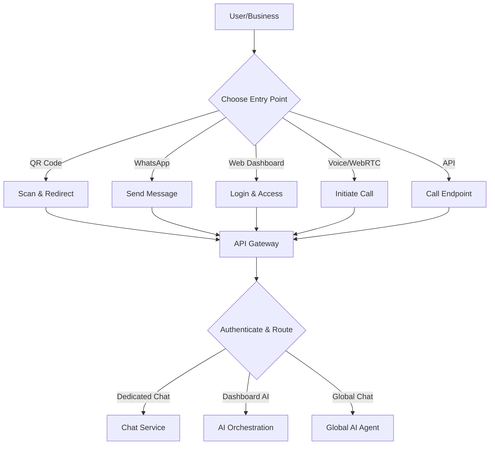

# Entry Points in X-sevenAI

## Overview

X-sevenAI features multiple entry points to ensure seamless access for users (customers and businesses) across devices and channels. These entry points funnel into the three core chat systems: **Dedicated Chat**, **Dashboard AI Chat**, and **Global Chat**. Each is secured, scalable, and controlled via the API Gateway Service (Kong), with authentication handled by Supabase. This design supports omnichannel experiences while maintaining enterprise-grade security and performance.

## Types of Entry Points

### 1. **Web/Mobile Dashboards**
   - **Description**: Browser-based or app interfaces for direct access to dashboards and chats.
   - **For Whom**: Businesses (Dashboard AI Chat) and customers (Global Chat).
   - **How It Works**: Users log in via Supabase auth. Dashboards load with WebSockets for real-time interactions.
   - **Control**: API Gateway routes requests, enforcing rate limits and JWT validation. Kong plugins handle CORS and session management.
   - **Examples**:
     - Business owner logs into dashboard to chat with AI.
     - Customer accesses web portal for Global Chat.

### 2. **QR Codes**
   - **Description**: Scannable codes linking to chats (e.g., table QR for restaurants, business QR for general access).
   - **For Whom**: Customers (Dedicated Chat) and businesses.
   - **How It Works**: QR scans redirect to a URL, triggering the appropriate chat system. Encodes business ID for context.
   - **Control**: Scanned URLs hit the API Gateway, which authenticates and routes to the Chat & Communication Service. Zapier can generate/manage QR integrations.
   - **Examples**:
     - Table QR in a restaurant starts Dedicated Chat for ordering.
     - Business QR on signage initiates Global Chat for inquiries.

### 3. **WhatsApp Integration**
   - **Description**: Direct messaging via WhatsApp for conversational access.
   - **For Whom**: Customers (Dedicated/Global Chat) and businesses (Dashboard AI Chat via webhooks).
   - **How It Works**: Webhooks from WhatsApp API forward messages to the platform. AI agents respond in real-time.
   - **Control**: Zapier handles webhook setup and message routing. API Gateway secures incoming data, with rate limiting to prevent spam.
   - **Examples**:
     - Customer messages business WhatsApp for Dedicated Chat.
     - Business owner receives WhatsApp notifications from Dashboard AI.

### 4. **Instagram/Facebook Integration**
   - **Description**: Social media messaging for marketing and support.
   - **For Whom**: Customers (Global Chat) and businesses (via notifications).
   - **How It Works**: Meta Graph API webhooks capture messages, integrated via Zapier for automation.
   - **Control**: API Gateway filters and authenticates social inputs. Temporal workflows manage follow-ups.
   - **Examples**:
     - Customer DMs business Instagram for reservations via Global Chat.
     - AI posts automated responses on business pages.

### 5. **Voice/WebRTC Calls**
   - **Description**: Audio/video calls for immersive interactions.
   - **For Whom**: Customers (Global/Dedicated Chat) and businesses (Dashboard AI).
   - **How It Works**: WebRTC handles P2P connections; ElevenLabs/Whisper processes voice. Initiated via chat links.
   - **Control**: API Gateway secures call setups. Kong enforces encryption and access controls.
   - **Examples**:
     - Voice chat in Global Chat for hands-free ordering.
     - Business video call via Dashboard AI.

### 6. **API Endpoints**
   - **Description**: Programmatic access for integrations or third-party apps.
   - **For Whom**: Developers, partners, or automated systems.
   - **How It Works**: RESTful endpoints exposed via FastAPI, allowing direct chat initiation or data queries.
   - **Control**: Full Kong management—auth required, with OAuth for external access. Prometheus monitors usage.
   - **Examples**:
     - App integrates Global Chat API for custom UIs.
     - Business tools pull data via endpoints.

## Control and Security Mechanisms

- **Central Control**: All entry points route through the **API Gateway Service** (Kong), which acts as a single control point. It applies policies like authentication (Supabase), rate limiting, logging, and circuit breakers.
- **Authentication**: Supabase handles user/business auth. For anonymous access (e.g., QR scans), temporary tokens are issued.
- **Scalability**: Kubernetes auto-scales services based on traffic from entry points. Redis caches frequent requests.
- **Monitoring**: Prometheus tracks entry point usage; Grafana dashboards alert on anomalies.
- **Fallbacks**: If one entry point fails (e.g., WhatsApp outage), users can switch to another (e.g., web dashboard).
- **Compliance**: End-to-end encryption (TLS 1.3) and data masking for privacy.

## Flow of Entry Points

## Summary
X-sevenAI has 6 primary entry points, all controlled securely via the API Gateway for unified access to the chat systems. This ensures flexibility, security, and a "wow" user experience.

---

*X-sevenAI: Seamless Entry, Intelligent Control.*
