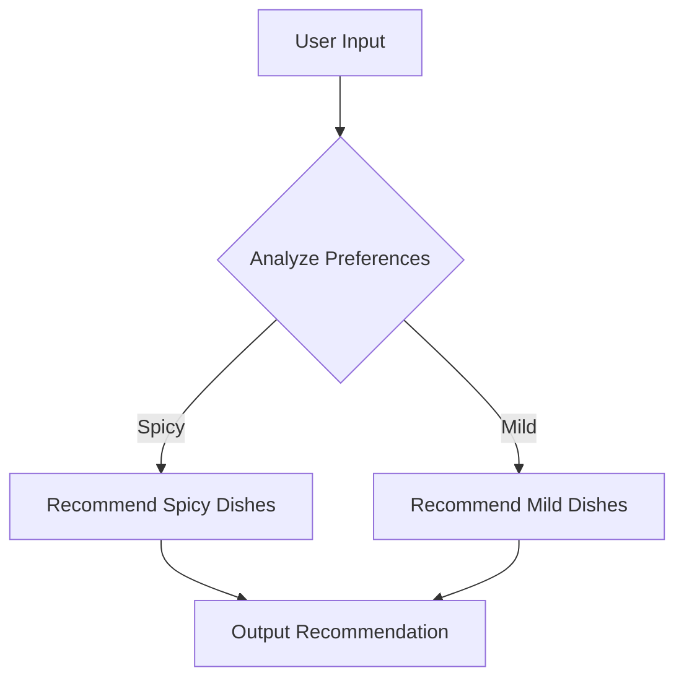
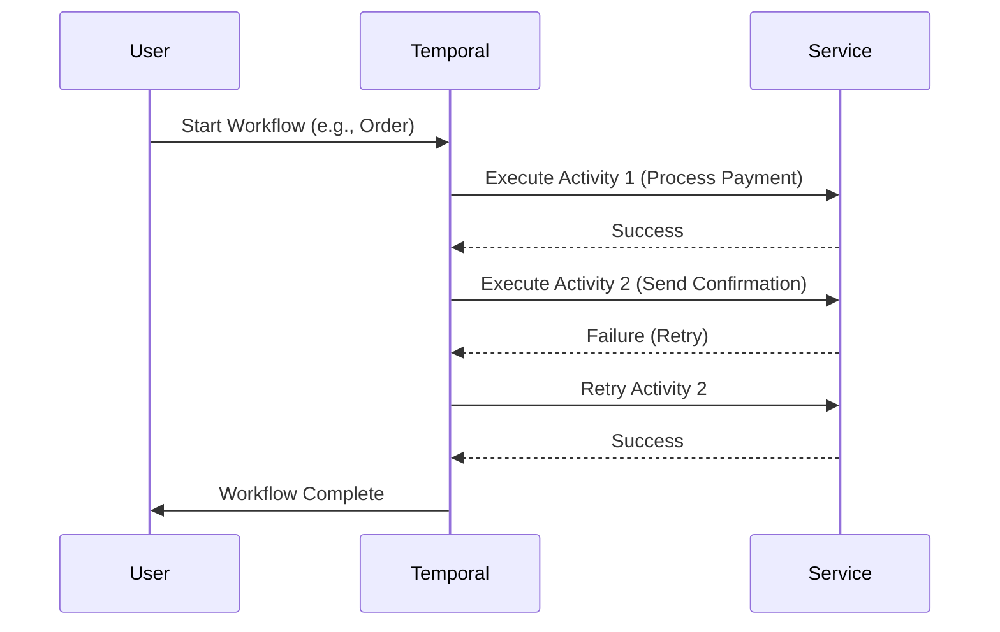
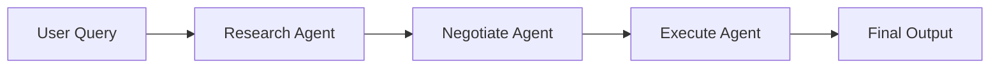
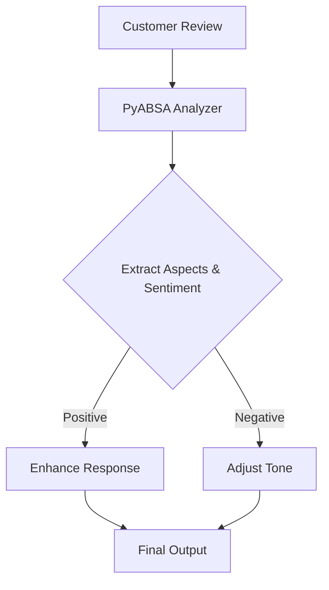
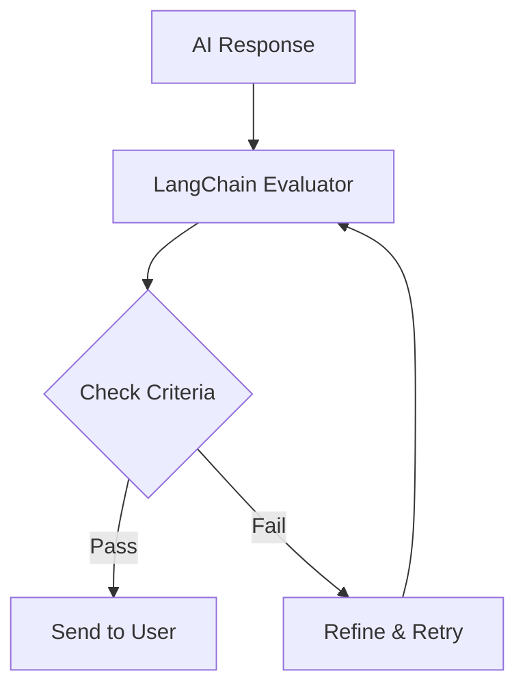
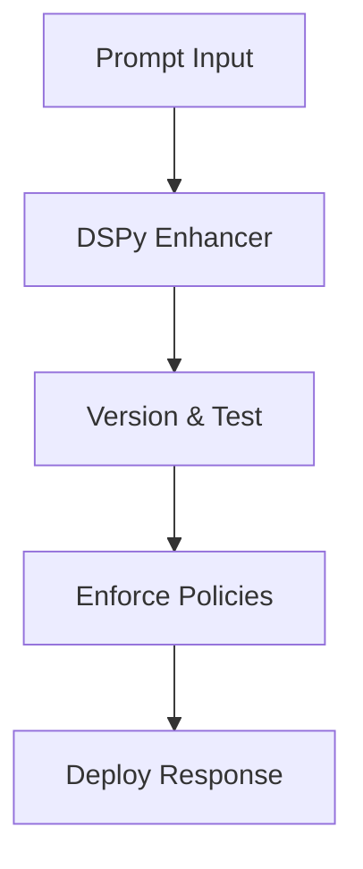
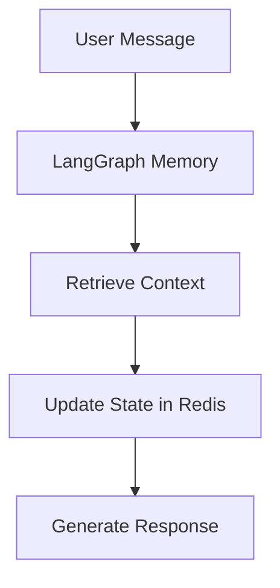

# Frameworks and Tools in X-sevenAI

## Overview

X-sevenAI is built on a robust stack of frameworks and tools for AI-driven business automation. This document details each component, its purpose, how it works, integration with others, and flows. The architecture emphasizes scalability, security, and intelligence across microservices, enabling seamless operations for categories like restaurants, salons, freelancing, and local shops.

## Core Frameworks and Tools

### 1. **LangGraph**
**What It Is**: A graph-based framework for building dynamic AI workflows, allowing nodes (steps) and edges (transitions) to model complex decision-making.

**Purpose**: Handles branching logic in AI processes, such as personalized recommendations or adaptive automations in business categories (e.g., menu suggestions in restaurants).

**How It Works**:
- Define nodes as functions (e.g., data analysis, decision logic).
- Edges connect nodes based on conditions (e.g., if user prefers spicy, branch to spicy menu).
- Executes in a directed acyclic graph (DAG) for predictable flows.

**Integration**: Feeds into Temporal for orchestration and DSPy for prompt optimization. Used in AI Orchestration Service.

**Flow Example**:


**Explanation**: Starts with user data, branches based on logic, ends with tailored output. Scalable for multi-category use.

### 2. **Temporal**
**What It Is**: A durable workflow orchestration platform for managing long-running, fault-tolerant processes.

**Purpose**: Ensures reliable execution of business workflows (e.g., order fulfillment in restaurants or appointment scheduling in salons), with retries and state persistence.

**How It Works**:
- Workflows are code-defined activities (e.g., book reservation, send notification).
- Handles failures by pausing/resuming, storing state in durable storage.
- Supports timers, signals, and child workflows.

**Integration**: Orchestrates LangGraph outputs and Crew AI agents. Integrated in Business Logic Service and AI Orchestration Service.

**Flow Example**:


**Explanation**: Provides durability—workflows survive crashes. Ideal for enterprise reliability.

### 3. **Crew AI**
**What It Is**: A multi-agent AI framework for collaborative tasks, where agents (AI entities) work as a team.

**Purpose**: Enables team-like AI interactions (e.g., in freelancing: one agent researches, another negotiates). Used for complex, creative tasks across categories.

**How It Works**:
- Define agents with roles, tools, and goals (e.g., "Researcher" uses web search).
- Agents communicate via shared memory, delegating tasks.
- Executes in crews (groups) with hierarchical or flat structures.

**Integration**: Integrates with DSPy for prompts and Temporal for workflow management. Used in AI Orchestration Service.

**Flow Example**:


**Explanation**: Agents specialize and collaborate, creating "wow" moments like automated negotiations.

### 4. **DSPy**
**What It Is**: A declarative framework for prompt engineering and optimizing interactions with LLMs.

**Purpose**: Fine-tunes AI responses for accuracy and relevance (e.g., voice assistants in salons or chatbots in local shops).

**How It Works**:
- Define modules for tasks (e.g., question answering, summarization).
- Automatically optimizes prompts via training data and metrics.
- Supports fallbacks to multiple LLMs (OpenAI, Groq, Cloud).

**Integration**: Powers prompts for LangGraph, Crew AI, and ElevenLabs. Used in AI Orchestration Service.

**Flow Example**:
```mermaid
flowchart TD
    B --> C[Optimize via Training]
    C --> D[Generate Response]
    D --> E[Evaluate & Refine]

### 22. **Flexible POS Integration Modes**
**What It Is**: Dual-mode integration strategy supporting both dashboard-primary and external POS-primary workflows with platforms like Square or Fresha.

**Purpose**: Allows businesses to either make X-sevenAI the primary system of record or keep their existing POS as the source of truth while still leveraging AI-driven automation and analytics.


**How It Works**:
- Defines pipelines as sequences of processors (e.g., input parsing, model inference).
- Handles streaming data with error handling.

**Integration**: Connects to LangGraph and Kafka for event-driven AI.

**Flow Example**:
```mermaid
graph TD
    A[Input Stream] --> B[Pipecat Pipeline]
    B --> C[Process 1: Parse]
    C --> D[Process 2: Infer]
    D --> E[Output]
```

**Explanation**: Simplifies complex data flows in microservices.

### 6. **Evaluation API**
**What It Is**: A custom API for assessing AI model performance and prompt effectiveness.

**Purpose**: Monitors and improves AI quality (e.g., evaluating chat accuracy in restaurants).

**How It Works**:
- Runs metrics on outputs (e.g., accuracy, bias).
- Provides feedback for DSPy optimization.

**Integration**: Used with DSPy and Crew AI for continuous improvement.

### 7. **FastAPI**
**What It Is**: A high-performance web framework for building APIs in Python.

**Purpose**: Powers backend services (e.g., API Gateway, Business Logic Service).

**How It Works**:
- Asynchronous endpoints with auto-generated docs.
- Integrates with Supabase and Redis.

**Integration**: Core for all microservices, with WebSockets for real-time features.

### 8. **Supabase**
**What It Is**: A PostgreSQL-based backend-as-a-service with real-time features.

**Purpose**: Handles database, auth, and real-time subscriptions.

**How It Works**:
- Provides tables, auth, and edge functions.
- Real-time via WebSockets.

**Integration**: Central data store for all services.

### 9. **Redis**
**What It Is**: An in-memory data store for caching and sessions.

**Purpose**: Speeds up frequent queries (e.g., user sessions in salons).

**How It Works**:
- Key-value storage with expiration.
- Clustering for scalability.

**Integration**: Caches for FastAPI and AI services.

### 10. **Kafka**
**What It Is**: An event streaming platform for high-throughput messaging.

**Purpose**: Decouples microservices (e.g., order events in restaurants).

**How It Works**:
- Topics for event publishing/subscribing.
- Fault-tolerant with partitions.

**Integration**: Connects services like Chat and Analytics.

### 11. **ElevenLabs & Whisper**
**What It Is**: ElevenLabs for text-to-speech; Whisper for speech-to-text.

**Purpose**: Enables voice features (e.g., AI assistants in shops).

**How It Works**:
- APIs for voice processing.
- Integrates with DSPy for prompts.

**Integration**: Used in Chat & Communication Service.

### 12. **Kong**
**What It Is**: An API gateway for routing and security.

**Purpose**: Manages external access to microservices.

**How It Works**:
- Plugins for auth, rate limiting.
- Routes requests.

**Integration**: Fronts all services.

### 13. **Prometheus & Grafana**
**What It Is**: Prometheus for metrics collection; Grafana for visualization.

**Purpose**: Monitors system health.

**How It Works**:
- Scrapes metrics, alerts on thresholds.
- Dashboards for insights.

**Integration**: Used in Monitoring Service.

### 14. **Zapier**
**What It Is**: A no-code automation tool for integrations.

**Purpose**: Connects to third parties (e.g., Instagram for marketing).

**How It Works**:
- Webhooks and triggers.

### 16. **Haystack**
**What It Is**: An open-source framework for building Retrieval-Augmented Generation (RAG) pipelines, focusing on semantic search and context enhancement.

**Purpose**: Enhances AI responses by retrieving relevant business data (e.g., from Supabase or Pinecone) to reduce hallucinations in queries like menu recommendations or reservation details.

**How It Works**:
- Integrates with vector databases (e.g., Pinecone/pgvector) for semantic retrieval.
- Builds pipelines that combine retrieval with LLM generation, ensuring contextually accurate outputs.
- Supports multimodal inputs for documents or images in business contexts.

**Integration**: Extends DSPy and LangGraph for RAG in AI Orchestration Service; connects to Supabase for data storage and Kafka for event-driven updates.

**Flow Example**:


```mermaid
graph TD
    A[User Query] --> B[Haystack Retriever]
    B --> C[Fetch Relevant Data]
    C --> D[LLM Generation]
    D --> E[Accurate Response]
```

**Explanation**: Retrieves precise context from business data, improving accuracy in customer-facing outputs like orders.

### 17. **PyABSA**
**What It Is**: A Python library for Aspect-Based Sentiment Analysis (ABSA), detecting sentiment per aspect (e.g., food quality vs. service).

**Purpose**: Allows AI to understand customer emotions and preferences, enabling personalized responses in chats or voice interactions for better business outcomes.

**How It Works**:
- Analyzes text for aspects (e.g., "food" or "wait time") and assigns sentiment scores.
- Integrates with LLMs for dynamic adjustments (e.g., empathetic replies for negative sentiment).

**Integration**: Feeds into DSPy for prompt tuning and ElevenLabs for voice tone; used in Global Chat and Communication Services.

**Flow Example**:


**Explanation**: Provides granular insight into customer feedback, improving AI empathy and accuracy.

### 18. **LangChain Evaluators**
**What It Is**: A set of tools from LangChain for evaluating AI responses in real-time, including metrics for relevance, politeness, and correctness.

**Purpose**: Ensures production-level quality in business outputs (e.g., validating reservation confirmations or order details before sending).

**How It Works**:
- Runs automated checks on AI-generated text (e.g., BLEU scores or custom criteria).
- Provides feedback loops for prompt optimization in DSPy.

**Integration**: Works with Evaluation API and DSPy in AI Orchestration Service; ties into Kafka for async evaluations.

**Flow Example**:


**Explanation**: Validates outputs pre-deployment, reducing errors in high-stakes scenarios.

### 19. **Enhanced DSPy for Prompt Management**
**What It Is**: Extensions to DSPy for advanced prompt versioning, policy enforcement, and automated testing.

**Purpose**: Manages prompts to ensure natural, consistent AI speech while adhering to business rules (e.g., always polite in customer support).

**How It Works**:
- Adds versioning for prompt rollbacks and multi-agent coordination.
- Enforces policies (e.g., no harmful content) and supports automated tests.

**Integration**: Builds on existing DSPy usage; integrates with LangGraph for workflows and Redis for caching prompt states.

**Flow Example**:


**Explanation**: Ensures reliable, rule-compliant AI for production use.

### 20. **LangGraph Memory Modules with Redis**
**What It Is**: Extensions to LangGraph for persistent memory and state management, integrated with Redis for fast caching.

**Purpose**: Maintains context in multi-step conversations (e.g., remembering customer preferences across chat sessions).

**How It Works**:
- Stores conversation states in Redis for quick retrieval.
- Enables branching based on historical data.

**Integration**: Enhances LangGraph in AI Orchestration; connects to Kafka for event persistence.

**Flow Example**:


### 21. **Intelligent PDF Upload and Extraction for Dashboards**
**What It Is**: A feature for handling PDF uploads (e.g., menus, categories) in the business dashboard, using AI for extraction, categorization, and display with photos.

**Purpose**: Automates content population in dashboard sections (e.g., menus, galleries) by extracting text and images from PDFs, reducing manual effort for business owners.

**How It Works**:
- Upload PDF via frontend; backend uses OCR (e.g., Tesseract or Google Vision) to extract text and images.
- AI (e.g., DSPy/OpenAI) categorizes content (e.g., menu items into sections); CLIP tags images for relevance.
- Stores in Supabase; displays via WebSockets for real-time updates.

**Integration**: Extends Haystack for RAG on extracted data; uses PyABSA for aspect-based categorization; ties into FastAPI for APIs and Redis for caching.

**Flow Example**:
```mermaid
graph TD
    A[Upload PDF] --> B[OCR Extraction]
