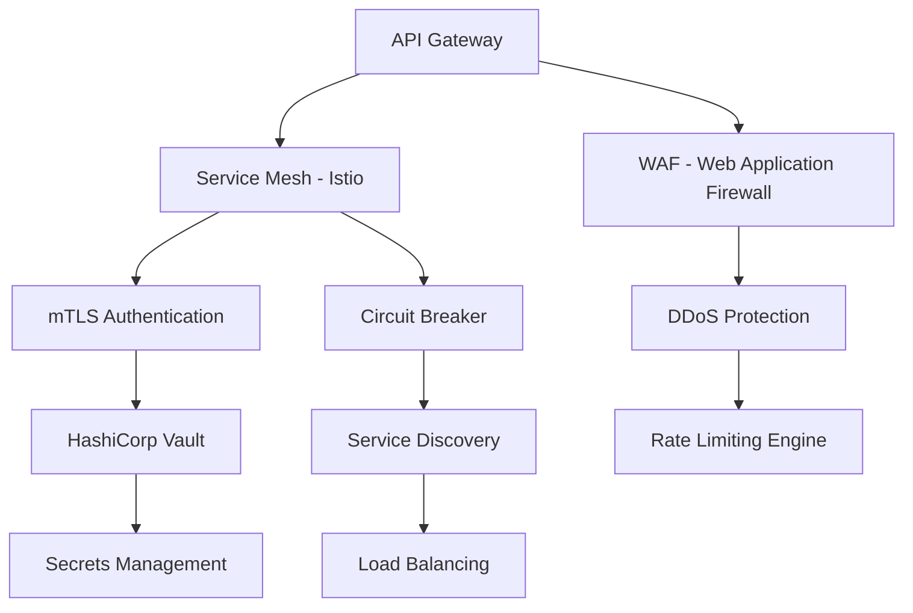
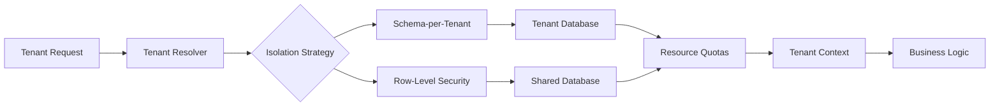
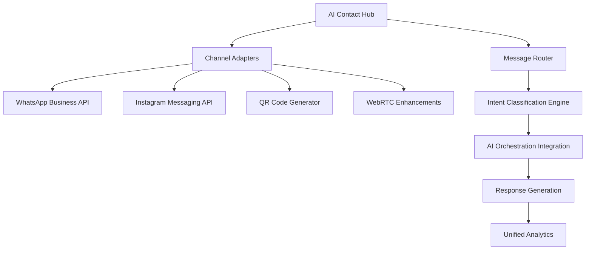
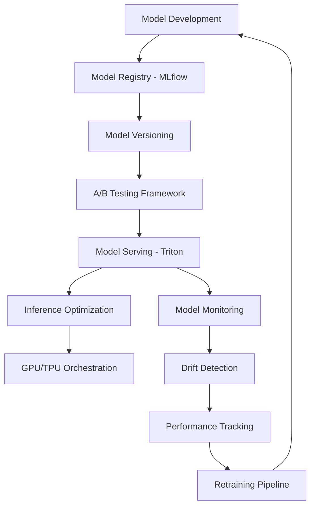
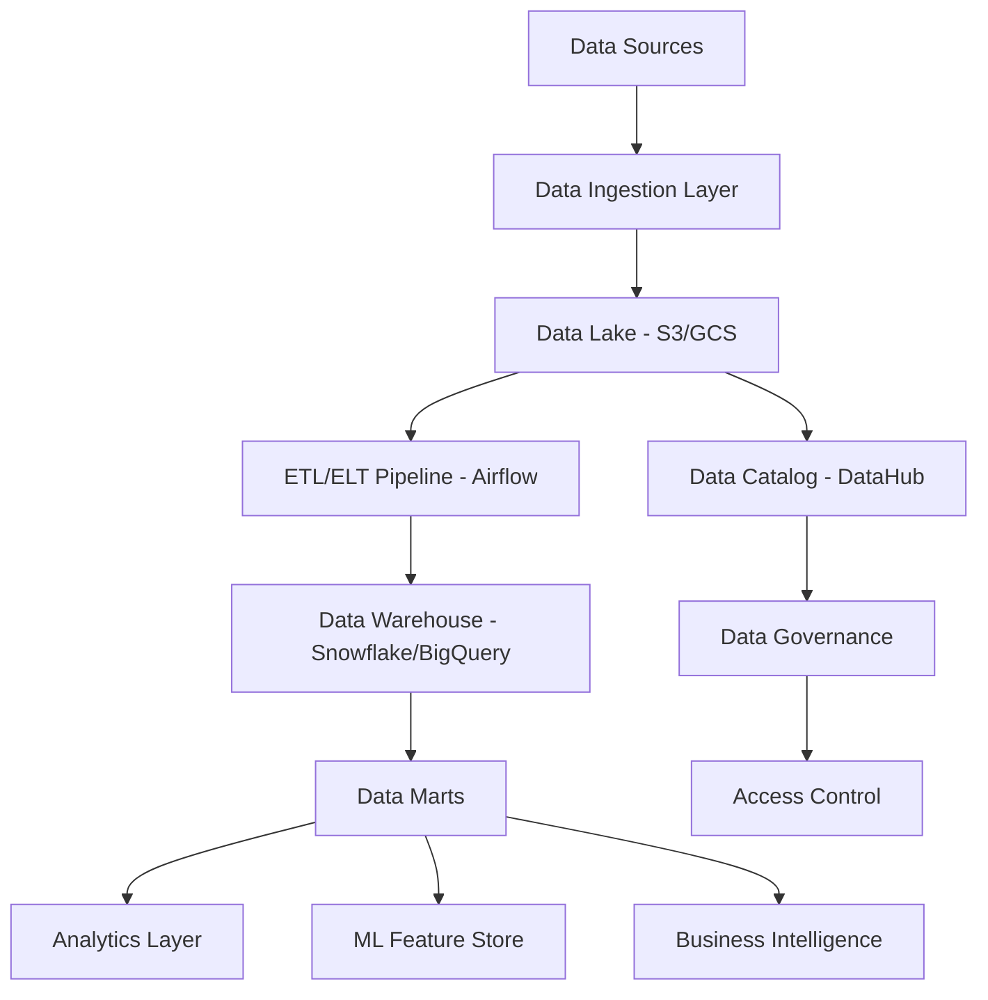
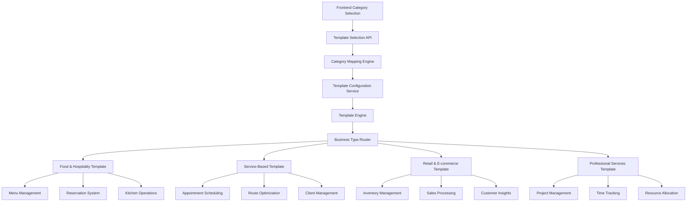
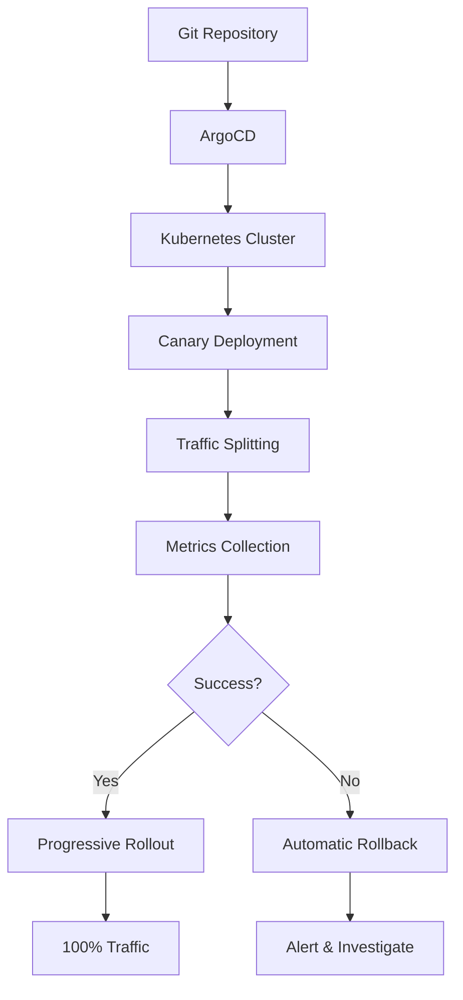

# 🚀 **X-sevenAI Enterprise Backend Implementation Plan - 3-Phase Strategy**

**Version:** 1.0 | **Date:** October 2025 | **Classification:** Enterprise Implementation Blueprint

---

## 📋 **Executive Summary**

This document outlines a **world-class, enterprise-grade 3-phase implementation strategy** for X-sevenAI's unified business automation platform. The plan leverages existing robust infrastructure while systematically building missing components into a cohesive, scalable ecosystem that delivers seamless customer experiences across all touchpoints.

---

## 🏗️ **Current Architecture Assessment**

### ✅ **Existing Infrastructure (40% Complete)**

#### **🧠 AI Orchestration Service - FULLY OPERATIONAL**
```python
# Production-ready AI frameworks:
- LangGraph: Complex workflow orchestration
- CrewAI: Multi-agent collaboration
- DSPy: Advanced prompt optimization
- Haystack RAG: Knowledge retrieval
- Multi-LLM: OpenAI, Groq, Anthropic support
```

#### **📊 Analytics Dashboard Service - SUBSTANTIAL IMPLEMENTATION**
```python
# Existing dashboard capabilities:
- Menu Management API (comprehensive CRUD)
- Inventory Management System
- Operations & Analytics Endpoints
- Real-time WebSocket Support
- PDF Processing Capabilities
```

#### **💬 Communication Infrastructure - FOUNDATION LAID**
```python
# Communication channels ready:
- WebRTC Voice/Video (LiveKit integration)
- WebSocket Real-time Chat
- Twilio SMS/MMS Infrastructure
- SendGrid Email Integration
- Multi-channel Webhook Handlers
```

#### **🔧 Enterprise Infrastructure - FULLY CONFIGURED**
```python
# Production-grade foundation:
- Supabase Database & Authentication
- Redis State Management & Caching
- Kafka Event Streaming
- Prometheus Monitoring & Metrics
- OpenTelemetry Distributed Tracing
- Sentry Error Tracking & Alerting
```

---

## 📦 **Feature Catalog - Complete Implementation Scope**

### **🎯 13 AI Features (6 Universal + 7 Category-Specific)**

#### **🌍 Universal AI Features (6/6 Required)**
| Feature | Status | Integration Point |
|---------|--------|------------------|
| **🧠 AI Insight Engine** | ❌ Missing | Analytics Dashboard |
| **🔮 Predictive Intelligence** | ❌ Missing | All Templates |
| **⚡ AI Automation Workflows** | ❌ Missing | Business Logic Service |
| **💬 AI Copilot Chat** | ❌ Missing | Chat Communication |
| **📊 AI-Generated Reports** | ❌ Missing | Analytics Service |
| **🎯 AI Business Coach** | ❌ Missing | All Templates |

#### **🏢 Category-Specific AI Features (7/7 Required)**
| Feature | Food & Hospitality | Service-Based | Retail & E-commerce | Professional Services |
|---------|-------------------|---------------|---------------------|----------------------|
| **📈 Customer Retention Predictor** | ❌ | ❌ | ❌ | ❌ |
| **🍽️ Smart Menu/Service Optimizer** | ❌ | ❌ | ❌ | ❌ |
| **💰 Dynamic Pricing Engine** | ❌ | ❌ | ❌ | ❌ |
| **🗺️ AI Route Optimizer** | ❌ | ❌ | ❌ | ❌ |
| **📋 Project Profitability Analyzer** | ❌ | ❌ | ❌ | ❌ |
| **🎲 What-If Simulator** | ❌ | ❌ | ❌ | ❌ |
| **👁️ Competitor & Market Watchdog** | ❌ | ❌ | ❌ | ❌ |

### **📱 Communication Channel Integrations**

#### **WhatsApp Integration**
- **Status:** ❌ **Not Implemented**
- **Requirements:**
  - WhatsApp Business API Integration
  - Message Template Management
  - Automated Response Workflows
  - Conversation Threading
  - Delivery Status Tracking

#### **Instagram Integration**
- **Status:** ❌ **Not Implemented**
- **Requirements:**
  - Instagram Basic Display API
  - Direct Message Processing
  - Visual Content Recognition
  - Story/Post Interaction
  - Product Catalog Integration

#### **QR Code System**
- **Status:** ❌ **Not Implemented**
- **Requirements:**
  - Dynamic QR Code Generation
  - Context-Aware Chat Initialization
  - Shareable Link Management
  - Mobile-Responsive Chat Interface

### **🏪 Business Dashboard Templates**

#### **🍽️ Food & Hospitality Template**
- **Status:** 🟡 **Partially Implemented** (Menu/Inventory APIs exist)
- **Missing Components:**
  - Table & Reservation Management
  - Kitchen Operations Integration
  - AI-Powered Menu Optimization
  - Customer Experience Analytics

#### **✂️ Service-Based Template**
- **Status:** ❌ **Not Implemented**
- **Required Components:**
  - Appointment Scheduling Engine
  - Service Management System
  - Client Management Portal
  - Route Optimization Algorithms

#### **🛍️ Retail & E-commerce Template**
- **Status:** ❌ **Not Implemented**
- **Required Components:**
  - Advanced Inventory Management
  - Sales & Checkout Integration
  - Customer Insights Engine
  - E-commerce Platform Connectors

#### **💼 Professional Services Template**
- **Status:** ❌ **Not Implemented**
- **Required Components:**
  - Project Management System
  - Time Tracking & Billing
  - Client Portal & Document Management
  - Resource Allocation Engine

---

## 🎯 **3-Phase Implementation Strategy**

---

## **🌟 Phase 1: Enterprise Foundation & Security (Weeks 1-4)**
### **"Building the Secure, Scalable Communication Backbone"**

#### **1.1 Enterprise Security & Multi-Tenancy Foundation**

**🔐 Zero Trust Security Architecture:**



**📋 Critical Security Deliverables:**

**🔒 Service Mesh Implementation (Istio):**
- **Mutual TLS (mTLS)** - Encrypted service-to-service communication
- **Traffic Management** - Intelligent routing, load balancing, circuit breaking
- **Observability** - Distributed tracing across all microservices
- **Policy Enforcement** - Fine-grained access control between services
- **Canary Deployments** - Progressive rollout capabilities

**🔑 Secrets Management (HashiCorp Vault):**
- **Dynamic Secrets** - Auto-rotating credentials for databases and APIs
- **Encryption as a Service** - Centralized encryption key management
- **Audit Logging** - Complete audit trail for all secret access
- **Multi-Cloud Support** - Unified secrets across cloud providers
- **Integration Points:**
  ```python
  # Vault integration for all services
  class VaultSecretManager:
      def __init__(self):
          self.vault_client = hvac.Client(url=VAULT_URL)
          self.auth_method = 'kubernetes'  # K8s service account auth
      
      async def get_database_credentials(self, role: str):
          """Dynamic database credentials with auto-rotation"""
          return await self.vault_client.secrets.database.generate_credentials(role)
      
      async def get_api_key(self, service: str):
          """Retrieve API keys for external services"""
          return await self.vault_client.secrets.kv.v2.read_secret(f'api-keys/{service}')
  ```

**🏢 Multi-Tenancy Architecture:**



**Multi-Tenancy Implementation:**
- **Hybrid Isolation Model:**
  - **Enterprise Tier** - Dedicated schema per tenant (complete isolation)
  - **Premium/Basic Tier** - Row-level security with shared schema
  - **Data Encryption** - Tenant-specific encryption keys

- **Resource Management:**
  ```python
  class TenantResourceManager:
      def __init__(self):
          self.quota_engine = ResourceQuotaEngine()
          self.isolation_strategy = HybridIsolationStrategy()
      
      async def enforce_quotas(self, tenant_id: str, resource_type: str):
          """Enforce per-tenant resource limits"""
          quota = await self.quota_engine.get_quota(tenant_id, resource_type)
          usage = await self.quota_engine.get_usage(tenant_id, resource_type)
          
          if usage >= quota:
              raise ResourceQuotaExceeded(f"Tenant {tenant_id} exceeded {resource_type} quota")
      
      async def get_tenant_context(self, tenant_id: str) -> TenantContext:
          """Retrieve complete tenant configuration and context"""
          return TenantContext(
              tenant_id=tenant_id,
              isolation_level=await self.isolation_strategy.get_level(tenant_id),
              resource_quotas=await self.quota_engine.get_all_quotas(tenant_id),
              feature_flags=await self.get_feature_flags(tenant_id),
              encryption_key=await self.get_tenant_encryption_key(tenant_id)
          )
  ```

- **Tenant Isolation Guarantees:**
  - **Data Isolation** - Complete separation of tenant data
  - **Performance Isolation** - Resource quotas prevent noisy neighbor issues
  - **Security Isolation** - Tenant-specific encryption and access controls
  - **Configuration Isolation** - Per-tenant feature flags and customizations

**🛡️ API Security & Gateway Enhancement:**

- **OAuth2/OIDC Implementation:**
  ```python
  class EnterpriseAuthProvider:
      def __init__(self):
          self.oauth2_provider = OAuth2Provider()
          self.oidc_provider = OIDCProvider()
          self.jwt_manager = JWTManager()
      
      async def authenticate_request(self, request: Request) -> AuthContext:
          """Multi-factor authentication with OAuth2/OIDC"""
          token = self.extract_token(request)
          
          # Validate JWT signature and claims
          claims = await self.jwt_manager.validate_token(token)
          
          # Check tenant context
          tenant_id = claims.get('tenant_id')
          
          # Verify permissions
          permissions = await self.get_permissions(claims['user_id'], tenant_id)
          
          return AuthContext(
              user_id=claims['user_id'],
              tenant_id=tenant_id,
              permissions=permissions,
              roles=claims.get('roles', [])
          )
  ```

- **Advanced Rate Limiting:**
  - **Per-Tenant Rate Limits** - Configurable based on subscription tier
  - **Per-User Rate Limits** - Prevent individual user abuse
  - **Per-Endpoint Rate Limits** - Protect expensive operations
  - **Adaptive Rate Limiting** - Dynamic adjustment based on system load

- **WAF & DDoS Protection:**
  - **Cloudflare Enterprise** or **AWS WAF** integration
  - **Bot detection and mitigation**
  - **SQL injection and XSS protection**
  - **Geo-blocking capabilities**

**📊 API Gateway Enterprise Features:**

```python
class EnterpriseAPIGateway:
    def __init__(self):
        self.rate_limiter = AdaptiveRateLimiter()
        self.auth_provider = EnterpriseAuthProvider()
        self.api_versioning = APIVersionManager()
        self.monetization = APIMonetizationEngine()
        self.analytics = APIAnalyticsEngine()
    
    async def process_request(self, request: Request) -> Response:
        # 1. Authentication & Authorization
        auth_context = await self.auth_provider.authenticate_request(request)
        
        # 2. Rate Limiting
        await self.rate_limiter.check_limit(
            tenant_id=auth_context.tenant_id,
            user_id=auth_context.user_id,
            endpoint=request.path
        )
        
        # 3. API Versioning
        versioned_endpoint = await self.api_versioning.resolve_version(
            request.path, 
            request.headers.get('API-Version', 'v1')
        )
        
        # 4. Monetization Tracking
        await self.monetization.track_usage(
            tenant_id=auth_context.tenant_id,
            endpoint=request.path,
            cost_units=self.calculate_cost_units(request)
        )
        
        # 5. Execute Request
        response = await self.route_request(versioned_endpoint, request, auth_context)
        
        # 6. Analytics
        await self.analytics.record_request(
            tenant_id=auth_context.tenant_id,
            endpoint=request.path,
            response_time=response.elapsed_time,
            status_code=response.status_code
        )
        
        return response
```

**🔐 Compliance & Audit Framework:**

- **SOC 2 Type II Certification Path:**
  - **Security Controls** - Comprehensive security policy implementation
  - **Availability Controls** - High availability and disaster recovery
  - **Processing Integrity** - Data validation and error handling
  - **Confidentiality Controls** - Encryption and access management
  - **Privacy Controls** - GDPR, CCPA, HIPAA compliance

- **Audit Logging Architecture:**
  ```python
  class EnterpriseAuditLogger:
      def __init__(self):
          self.audit_store = AuditLogStore()  # Immutable append-only store
          self.compliance_engine = ComplianceEngine()
      
      async def log_event(self, event: AuditEvent):
          """Log all security-relevant events"""
          audit_record = AuditRecord(
              timestamp=datetime.utcnow(),
              tenant_id=event.tenant_id,
              user_id=event.user_id,
              action=event.action,
              resource=event.resource,
              ip_address=event.ip_address,
              user_agent=event.user_agent,
              result=event.result,
              metadata=event.metadata
          )
          
          # Store in immutable audit log
          await self.audit_store.append(audit_record)
          
          # Check compliance rules
          await self.compliance_engine.evaluate_event(audit_record)
      
      async def generate_compliance_report(
          self, tenant_id: str, report_type: str
      ) -> ComplianceReport:
          """Generate compliance reports (GDPR, SOC 2, etc.)"""
          return await self.compliance_engine.generate_report(
              tenant_id=tenant_id,
              report_type=report_type
          )
  ```

- **Data Governance:**
  - **Data Classification** - Automatic PII/PHI detection and tagging
  - **Data Retention Policies** - Automated data lifecycle management
  - **Right to be Forgotten** - GDPR Article 17 implementation
  - **Data Residency** - Geographic data storage compliance

#### **1.2 Multi-Channel Contact Hub Development**



**📋 Deliverables:**

**🔥 Critical Path - Communication Integrations**
- **WhatsApp Business API Integration**
  - Official WhatsApp Business API client
  - Message template management system
  - Automated response workflow engine
  - Conversation threading and context preservation

- **Instagram Messaging API Integration**
  - Instagram Basic Display API implementation
  - Direct message processing pipeline
  - Visual content recognition service
  - Story and post interaction handling

- **QR Code System Implementation**
  - Dynamic QR code generation service
  - Context embedding and business logic
  - Shareable link management system
  - Mobile-responsive chat interface backend

**🔧 Technical Architecture:**
```python
# Enhanced Service Integration
class MultiChannelContactHub:
    def __init__(self):
        self.channel_adapters = {
            'whatsapp': WhatsAppAdapter(),
            'instagram': InstagramAdapter(),
            'qrcode': QRCodeAdapter(),
            'webrtc': WebRTCAdapter()
        }
        self.intent_engine = IntentClassificationEngine()
        self.ai_orchestrator = AIOrchestrationService()
        self.analytics_engine = UnifiedAnalytics()
```

#### **1.3 MLOps & AI Governance Foundation**

**🤖 Enterprise MLOps Architecture:**



**📋 MLOps Deliverables:**

**🔬 Model Registry & Versioning (MLflow):**
```python
class EnterpriseMLOps:
    def __init__(self):
        self.model_registry = MLflowRegistry()
        self.feature_store = FeastFeatureStore()
        self.experiment_tracker = MLflowTracker()
    
    async def register_model(
        self, 
        model: Any, 
        model_name: str, 
        metadata: dict
    ) -> ModelVersion:
        """Register model with complete lineage tracking"""
        version = await self.model_registry.register_model(
            model=model,
            name=model_name,
            tags={
                'framework': metadata.get('framework'),
                'training_data_version': metadata.get('data_version'),
                'hyperparameters': metadata.get('hyperparameters'),
                'metrics': metadata.get('metrics')
            }
        )
        
        # Track model lineage
        await self.track_model_lineage(
            model_version=version,
            training_run_id=metadata.get('run_id'),
            dataset_version=metadata.get('data_version')
        )
        
        return version
    
    async def deploy_model_with_ab_testing(
        self,
        model_version: str,
        traffic_percentage: int = 10
    ):
        """Deploy model with A/B testing"""
        # Create shadow deployment
        shadow_deployment = await self.create_shadow_deployment(
            model_version=model_version,
            traffic_percentage=traffic_percentage
        )
        
        # Monitor performance
        await self.monitor_ab_test(
            control_version='current',
            treatment_version=model_version,
            metrics=['latency', 'accuracy', 'business_kpi']
        )
```

**🎯 Feature Store (Feast):**
```python
class FeatureStoreManager:
    def __init__(self):
        self.feast_store = feast.FeatureStore()
    
    async def get_online_features(
        self,
        tenant_id: str,
        entity_ids: List[str],
        feature_refs: List[str]
    ) -> Dict:
        """Retrieve real-time features for inference"""
        return await self.feast_store.get_online_features(
            features=feature_refs,
            entity_rows=[{'tenant_id': tenant_id, 'entity_id': eid} for eid in entity_ids]
        ).to_dict()
    
    async def materialize_features(
        self,
        start_date: datetime,
        end_date: datetime
    ):
        """Materialize batch features to online store"""
        await self.feast_store.materialize(
            start_date=start_date,
            end_date=end_date
        )
```

**📊 Model Monitoring & Drift Detection:**
```python
class ModelMonitoringService:
    def __init__(self):
        self.drift_detector = DriftDetector()
        self.performance_tracker = PerformanceTracker()
        self.alerting = AlertingService()
    
    async def monitor_model_performance(
        self,
        model_id: str,
        predictions: List[dict],
        actuals: List[dict] = None
    ):
        """Continuous model performance monitoring"""
        # Detect data drift
        drift_score = await self.drift_detector.detect_drift(
            model_id=model_id,
            current_data=predictions
        )
        
        if drift_score > DRIFT_THRESHOLD:
            await self.alerting.send_alert(
                severity='high',
                message=f'Data drift detected for model {model_id}',
                drift_score=drift_score
            )
        
        # Track prediction performance
        if actuals:
            metrics = await self.performance_tracker.calculate_metrics(
                predictions=predictions,
                actuals=actuals
            )
            
            if metrics['accuracy'] < ACCURACY_THRESHOLD:
                await self.trigger_retraining(model_id)
```

**🚀 Model Serving & Optimization:**
- **NVIDIA Triton Inference Server** - High-performance model serving
- **GPU/TPU Orchestration** - Kubernetes GPU scheduling
- **Model Optimization:**
  - **Quantization** - INT8/FP16 precision reduction
  - **Pruning** - Remove unnecessary model weights
  - **Knowledge Distillation** - Smaller student models
  - **ONNX Runtime** - Cross-platform optimization

**💰 LLM Cost Optimization:**
```python
class LLMCostOptimizer:
    def __init__(self):
        self.cache = SemanticCache()  # Cache similar queries
        self.router = ModelRouter()   # Route to cheapest suitable model
        self.budget_manager = BudgetManager()
    
    async def optimize_llm_call(
        self,
        prompt: str,
        tenant_id: str,
        required_quality: str = 'high'
    ) -> LLMResponse:
        # Check semantic cache
        cached_response = await self.cache.get_similar(prompt, threshold=0.95)
        if cached_response:
            return cached_response
        
        # Check budget
        await self.budget_manager.check_budget(tenant_id)
        
        # Route to optimal model
        model = await self.router.select_model(
            prompt_complexity=self.analyze_complexity(prompt),
            required_quality=required_quality,
            cost_constraint=await self.budget_manager.get_remaining_budget(tenant_id)
        )
        
        # Execute and cache
        response = await model.generate(prompt)
        await self.cache.store(prompt, response)
        
        return response
```

**🎯 AI Governance & Explainability:**
- **Model Explainability** - SHAP, LIME integration
- **Bias Detection** - Fairness metrics monitoring
- **Model Cards** - Comprehensive model documentation
- **Ethical AI Framework** - Responsible AI guidelines

#### **1.4 AI Feature Foundation**

**Universal AI Features Implementation:**
- **AI Insight Engine** - Anomaly detection and root cause analysis
- **AI Copilot Chat** - Conversational business assistant foundation
- **AI-Generated Reports** - Automated report generation system

**Integration Points:**
- **AI Orchestration Service** - Leverage existing LangGraph workflows
- **Analytics Dashboard** - Connect with existing data structures
- **Communication Channels** - Enable AI responses across all channels

#### **1.5 Template & Feature Selection Microservice**

**🎯 Core Template Selection Service Development:**

**Category Mapping Engine:**
- **50+ Business Category Mappings** - Restaurant, salon, retail, law firm, etc.
- **ML-Enhanced Template Selection** - Continuous learning from selection patterns
- **Confidence Scoring System** - Provides accuracy metrics for each mapping
- **Alternative Template Suggestions** - Handles edge cases intelligently

**Template Configuration Service:**
- **4 Complete Template Configurations** - Food & Hospitality, Service-Based, Retail & E-commerce, Professional Services
- **Dynamic Feature Provisioning** - 13 AI features (6 universal + 7 category-specific)
- **Template-Specific API Endpoints** - Automatically configured based on business type
- **Dashboard Widget Configuration** - Industry-optimized layouts and components

**Feature Availability Engine:**
- **License-Based Feature Filtering** - Features based on subscription tier (basic, premium, enterprise)
- **Real-Time Feature Toggles** - Enable/disable features dynamically without deployment
- **Business Context Analysis** - Contextual feature enhancement based on business needs
- **Usage Analytics Integration** - Track feature adoption and performance

**Dynamic Configuration Generator:**
- **<100ms Response Time** - Real-time template configuration generation
- **Multi-Layer Caching** - Memory, Redis, and database caching for optimal performance
- **AI Workflow Integration** - Automatic LangGraph workflow setup for selected template
- **Complete Frontend Configuration** - Single API call provides all necessary configuration

**API Endpoints:**
```python
# Core Template Selection Endpoints
POST /api/v1/template-selection/select
  - Input: category, business_name, business_size, user_tier
  - Output: Complete template configuration with features, APIs, workflows

GET /api/v1/template-selection/categories
  - Returns: All 50+ available business categories with metadata

GET /api/v1/template-selection/templates  
  - Returns: All 4 templates with their feature sets and capabilities

POST /api/v1/template-selection/preview
  - Preview template configuration before applying

POST /api/v1/template-selection/customize
  - Customize template features for specific business needs
```

**Integration with AI Orchestration:**
```python
class TemplateAIIntegration:
    async def initialize_business_with_template(
        self, business_id: str, template_config: TemplateConfiguration
    ):
        # 1. Set up template-specific LangGraph workflows
        # 2. Initialize CrewAI agents for the template
        # 3. Configure RAG knowledge base with template data
        # 4. Set up automation workflows
        # 5. Initialize dashboard with template-specific data
```

**Enhanced Business Logic Service:**
- **Business Type Detection Engine** - Intelligent category classification
- **Template Selection Logic** - Smart template routing based on business context
- **Cross-Template Data Normalization** - Unified data models across templates
- **Unified Business Context Management** - Centralized context for all services

---

## **🏢 Phase 2: Template Ecosystem & Data Architecture (Weeks 5-8)**
### **"Building Industry-Specific Intelligence with Enterprise Data Foundation"**

#### **2.0 Enterprise Data Architecture**

**🏗️ Data Lake & Warehouse Architecture:**



**📋 Data Architecture Deliverables:**

**🌊 Data Lake Implementation:**
```python
class EnterpriseDataLake:
    def __init__(self):
        self.storage = S3Storage()  # or GCS/Azure Blob
        self.catalog = DataCatalog()
        self.governance = DataGovernance()
    
    async def ingest_data(
        self,
        source: str,
        data: Any,
        metadata: dict
    ) -> DataAsset:
        """Ingest data with automatic cataloging and governance"""
        # Classify data
        classification = await self.governance.classify_data(data)
        
        # Apply encryption based on classification
        if classification.contains_pii:
            data = await self.governance.encrypt_pii(data)
        
        # Store in data lake
        asset_path = await self.storage.store(
            data=data,
            partition_by=['tenant_id', 'date', 'source'],
            format='parquet'  # Columnar format for analytics
        )
        
        # Register in catalog
        await self.catalog.register_asset(
            path=asset_path,
            schema=self.infer_schema(data),
            metadata=metadata,
            classification=classification,
            tags=self.generate_tags(data, metadata)
        )
        
        return DataAsset(path=asset_path, metadata=metadata)
```

**🔄 ETL/ELT Pipeline (Apache Airflow):**
```python
class EnterpriseDataPipeline:
    def __init__(self):
        self.airflow = AirflowClient()
        self.dbt = DBTRunner()  # Data transformation
        self.quality = DataQualityEngine()
    
    async def create_pipeline(
        self,
        pipeline_name: str,
        source_config: dict,
        transform_config: dict,
        schedule: str = '@daily'
    ) -> Pipeline:
        """Create automated data pipeline"""
        dag = DAG(
            dag_id=pipeline_name,
            schedule_interval=schedule,
            default_args={
                'retries': 3,
                'retry_delay': timedelta(minutes=5),
                'on_failure_callback': self.alert_on_failure
            }
        )
        
        with dag:
            # Extract
            extract_task = PythonOperator(
                task_id='extract',
                python_callable=self.extract_data,
                op_kwargs={'source': source_config}
            )
            
            # Data Quality Checks
            quality_task = PythonOperator(
                task_id='quality_check',
                python_callable=self.quality.validate_data
            )
            
            # Transform (DBT)
            transform_task = BashOperator(
                task_id='transform',
                bash_command=f'dbt run --models {transform_config["models"]}'
            )
            
            # Load to Warehouse
            load_task = PythonOperator(
                task_id='load',
                python_callable=self.load_to_warehouse
            )
            
            extract_task >> quality_task >> transform_task >> load_task
        
        return await self.airflow.register_dag(dag)
```

**🏢 Data Warehouse (Snowflake/BigQuery):**
```python
class EnterpriseDataWarehouse:
    def __init__(self):
        self.warehouse = SnowflakeClient()  # or BigQueryClient
        self.optimizer = QueryOptimizer()
    
    async def create_tenant_schema(
        self,
        tenant_id: str,
        tier: str
    ):
        """Create isolated schema for enterprise tenant"""
        schema_name = f"tenant_{tenant_id}"
        
        # Create schema with resource quotas
        await self.warehouse.execute(f"""
            CREATE SCHEMA {schema_name}
            WITH MANAGED ACCESS
            DATA_RETENTION_TIME_IN_DAYS = {self.get_retention_days(tier)}
        """)
        
        # Set up resource monitor
        await self.warehouse.execute(f"""
            CREATE RESOURCE MONITOR {schema_name}_monitor
            WITH CREDIT_QUOTA = {self.get_credit_quota(tier)}
            TRIGGERS ON 90 PERCENT DO NOTIFY
                     ON 100 PERCENT DO SUSPEND
        """)
```

**📊 Data Governance Framework:**
```python
class DataGovernanceEngine:
    def __init__(self):
        self.classifier = DataClassifier()
        self.access_control = DataAccessControl()
        self.lineage_tracker = DataLineageTracker()
    
    async def enforce_governance(
        self,
        data_asset: DataAsset,
        user_context: UserContext
    ) -> bool:
        """Enforce data governance policies"""
        # Classify data
        classification = await self.classifier.classify(data_asset)
        
        # Check access permissions
        has_access = await self.access_control.check_permission(
            user=user_context,
            resource=data_asset,
            classification=classification
        )
        
        if not has_access:
            await self.audit_access_denial(
                user=user_context,
                resource=data_asset,
                reason='insufficient_permissions'
            )
            return False
        
        # Track data lineage
        await self.lineage_tracker.record_access(
            user=user_context,
            asset=data_asset,
            operation='read'
        )
        
        return True
```

**🔍 Data Catalog (DataHub/Amundsen):**
- **Automatic Schema Discovery** - Crawl and catalog all data assets
- **Data Lineage Visualization** - Track data flow across systems
- **Business Glossary** - Standardized terminology
- **Data Quality Metrics** - Automated quality scoring

**💾 Database Scalability & High Availability:**

```python
class DatabaseScalabilityManager:
    def __init__(self):
        self.primary_db = SupabaseClient(region='us-east-1')
        self.read_replicas = [
            SupabaseClient(region='us-west-1'),
            SupabaseClient(region='eu-west-1')
        ]
        self.connection_pool = PgBouncerPool()
    
    async def execute_query(
        self,
        query: str,
        operation_type: str = 'read'
    ):
        """Intelligent query routing with read replicas"""
        if operation_type == 'write':
            return await self.primary_db.execute(query)
        else:
            # Route reads to nearest replica
            replica = await self.select_optimal_replica()
            return await replica.execute(query)
    
    async def setup_sharding(
        self,
        shard_key: str = 'tenant_id',
        num_shards: int = 16
    ):
        """Implement database sharding for horizontal scaling"""
        for shard_id in range(num_shards):
            await self.create_shard(
                shard_id=shard_id,
                shard_key=shard_key
            )
```

**🔄 Backup & Disaster Recovery:**
```python
class DisasterRecoveryManager:
    def __init__(self):
        self.backup_service = BackupService()
        self.replication = ReplicationManager()
    
    async def configure_backup_strategy(
        self,
        tenant_id: str,
        tier: str
    ):
        """Configure backup based on SLA"""
        strategy = {
            'enterprise': {
                'rpo': timedelta(minutes=5),  # Recovery Point Objective
                'rto': timedelta(minutes=15), # Recovery Time Objective
                'backup_frequency': 'continuous',
                'retention_days': 90,
                'geo_redundancy': True
            },
            'premium': {
                'rpo': timedelta(hours=1),
                'rto': timedelta(hours=4),
                'backup_frequency': 'hourly',
                'retention_days': 30,
                'geo_redundancy': True
            },
            'basic': {
                'rpo': timedelta(hours=24),
                'rto': timedelta(hours=24),
                'backup_frequency': 'daily',
                'retention_days': 7,
                'geo_redundancy': False
            }
        }[tier]
        
        await self.backup_service.configure(
            tenant_id=tenant_id,
            strategy=strategy
        )
```

#### **2.1 Complete Dashboard Template Implementation**

**🔗 Integration with Template Selection Service:**



**📋 Template-Specific API Endpoints:**

**🍽️ Food & Hospitality Template APIs:**
```python
# Enhanced Menu Management
- POST /api/v1/menu/categories - Create menu categories
- GET /api/v1/menu/items/search - AI-powered menu search
- POST /api/v1/reservations - Table reservation system
- GET /api/v1/kitchen/display - Real-time kitchen display
- POST /api/v1/menu/optimize - AI menu optimization

# Table Management
- POST /api/v1/tables - Create/manage tables
- GET /api/v1/tables/status - Real-time table status
- POST /api/v1/reservations/book - Reservation booking
- GET /api/v1/analytics/table-turnover - Table turnover analytics

# Kitchen Operations
- WebSocket /ws/kitchen/orders - Real-time order updates
- POST /api/v1/kitchen/prep-times - Preparation time tracking
- GET /api/v1/inventory/alerts - Low inventory alerts
```

**✂️ Service-Based Template APIs:**
```python
# Appointment Management
- POST /api/v1/appointments - Book appointments
- GET /api/v1/schedule/optimize - AI scheduling optimization
- POST /api/v1/services - Service catalog management
- GET /api/v1/routes/optimize - Route optimization for mobile services

# Client Management
- GET /api/v1/clients/history - Client interaction history
- POST /api/v1/clients/preferences - Preference tracking
- GET /api/v1/analytics/client-retention - Retention analytics
```

**🛍️ Retail & E-commerce Template APIs:**
```python
# Advanced Inventory
- POST /api/v1/inventory/bulk-update - Bulk inventory operations
- GET /api/v1/inventory/forecast - AI inventory forecasting
- POST /api/v1/pricing/dynamic - Dynamic pricing engine
- GET /api/v1/competitors/monitor - Competitor price monitoring

# Sales & Customer Management
- POST /api/v1/sales/process - Point of sale integration
- GET /api/v1/customers/segmentation - Customer segmentation
- POST /api/v1/promotions/targeted - AI-powered promotions
```

**💼 Professional Services Template APIs:**
```python
# Project Management
- POST /api/v1/projects - Project creation and management
- GET /api/v1/projects/profitability - Real-time profitability tracking
- POST /api/v1/time/entries - Time tracking automation
- GET /api/v1/resources/allocation - Resource optimization

# Client Portal
- POST /api/v1/clients/portal-access - Client portal management
- GET /api/v1/projects/{id}/documents - Document management
- POST /api/v1/invoices/generate - Automated invoicing
```

#### **2.2 Advanced AI Features Integration**

**Category-Specific AI Features:**
- **Smart Menu Optimizer** - Menu performance analysis and recommendations
- **Dynamic Pricing Engine** - Real-time price optimization
- **Customer Retention Predictor** - Churn prediction and retention strategies
- **AI Route Optimizer** - Field service route optimization
- **Project Profitability Analyzer** - Real-time project profitability tracking
- **What-If Simulator** - Business scenario modeling
- **Competitor & Market Watchdog** - Market intelligence and competitor tracking

#### **2.3 Template-Specific Business Logic**

**Business Logic Service Enhancement:**
```python
# Template-specific processing engines
class TemplateProcessor:
    def __init__(self):
        self.template_engines = {
            'food_hospitality': FoodHospitalityEngine(),
            'service_based': ServiceBasedEngine(),
            'retail_ecommerce': RetailEcommerceEngine(),
            'professional_services': ProfessionalServicesEngine()
        }
        self.ai_orchestrator = AIOrchestrationService()
        self.analytics_engine = AnalyticsEngine()
```

---

## **🔗 Phase 3: DevOps Excellence & Business Continuity (Weeks 9-12)**
### **"Creating the Unified, Resilient Enterprise Ecosystem"**

#### **3.0 Advanced DevOps & GitOps**

**🚀 GitOps Implementation (ArgoCD):**



**📋 DevOps Excellence Deliverables:**

**🔄 GitOps & Continuous Deployment:**
```python
class GitOpsDeploymentManager:
    def __init__(self):
        self.argocd = ArgoCDClient()
        self.flagger = FlaggerClient()  # Progressive delivery
        self.metrics = PrometheusClient()
    
    async def deploy_with_canary(
        self,
        service_name: str,
        new_version: str,
        canary_steps: List[int] = [10, 25, 50, 75, 100]
    ):
        """Progressive canary deployment with automatic rollback"""
        # Create canary deployment
        canary = await self.flagger.create_canary(
            name=service_name,
            target_version=new_version,
            analysis={
                'interval': '1m',
                'threshold': 5,
                'max_weight': 50,
                'step_weight': 10,
                'metrics': [
                    {'name': 'request-success-rate', 'threshold': 99},
                    {'name': 'request-duration', 'threshold': 500}
                ]
            }
        )
        
        # Monitor canary progression
        for step in canary_steps:
            await self.flagger.set_traffic_weight(canary, step)
            
            # Collect metrics
            metrics = await self.metrics.get_canary_metrics(
                service_name=service_name,
                duration='5m'
            )
            
            # Evaluate success criteria
            if not self.evaluate_canary_health(metrics):
                await self.rollback_deployment(service_name, canary)
                raise DeploymentFailure(f"Canary deployment failed at {step}%")
            
            await asyncio.sleep(300)  # Wait 5 minutes between steps
        
        # Promote to production
        await self.flagger.promote_canary(canary)
```

**🏗️ Infrastructure as Code (Terraform):**
```hcl
# Complete infrastructure definition
module "enterprise_infrastructure" {
  source = "./modules/enterprise"
  
  # Multi-region deployment
  regions = ["us-east-1", "us-west-1", "eu-west-1"]
  
  # High availability configuration
  ha_config = {
    multi_az                = true
    auto_scaling_enabled    = true
    min_instances          = 3
    max_instances          = 100
    health_check_interval  = 30
  }
  
  # Database configuration
  database_config = {
    instance_class         = "db.r6g.2xlarge"
    multi_az              = true
    read_replicas         = 3
    backup_retention_days = 30
    encryption_enabled    = true
  }
  
  # Security configuration
  security_config = {
    enable_waf            = true
    enable_ddos_protection = true
    ssl_policy            = "TLS-1-2-2021"
    enable_secrets_manager = true
  }
}
```

**🔧 CI/CD Pipeline Enhancement:**
```yaml
# .github/workflows/enterprise-deploy.yml
name: Enterprise Deployment Pipeline

on:
  push:
    branches: [main, staging]

jobs:
  security-scan:
    runs-on: ubuntu-latest
    steps:
      - name: Code Security Scan
        uses: snyk/actions/node@master
      
      - name: Container Security Scan
        uses: aquasecurity/trivy-action@master
      
      - name: SAST Analysis
        uses: github/codeql-action/analyze@v2
  
  build-and-test:
    needs: security-scan
    runs-on: ubuntu-latest
    steps:
      - name: Run Unit Tests
        run: pytest tests/unit --cov
      
      - name: Run Integration Tests
        run: pytest tests/integration
      
      - name: Performance Tests
        run: k6 run tests/performance/load-test.js
  
  deploy-canary:
    needs: build-and-test
    runs-on: ubuntu-latest
    steps:
      - name: Deploy to Canary
        run: |
          argocd app sync ${{ env.APP_NAME }}
          kubectl argo rollouts promote ${{ env.APP_NAME }}
      
      - name: Monitor Canary
        run: |
          kubectl argo rollouts status ${{ env.APP_NAME }} --watch
```

**📊 Chaos Engineering:**
```python
class ChaosEngineeringFramework:
    def __init__(self):
        self.chaos_mesh = ChaosMeshClient()
        self.litmus = LitmusChaosClient()
    
    async def run_chaos_experiment(
        self,
        experiment_type: str,
        target_service: str
    ):
        """Run controlled chaos experiments"""
        experiments = {
            'pod_failure': self.simulate_pod_failure,
            'network_latency': self.simulate_network_latency,
            'cpu_stress': self.simulate_cpu_stress,
            'database_failure': self.simulate_database_failure
        }
        
        # Run experiment
        await experiments[experiment_type](target_service)
        
        # Collect metrics
        metrics = await self.collect_chaos_metrics(
            service=target_service,
            experiment=experiment_type
        )
        
        # Verify system resilience
        resilience_score = await self.calculate_resilience_score(metrics)
        
        return ChaosExperimentResult(
            experiment_type=experiment_type,
            target_service=target_service,
            resilience_score=resilience_score,
            metrics=metrics
        )
```

#### **3.1 Business Continuity & Incident Management**

**🚨 Incident Response Framework:**

```python
class IncidentManagementSystem:
    def __init__(self):
        self.pagerduty = PagerDutyClient()
        self.slack = SlackClient()
        self.runbook = RunbookEngine()
    
    async def handle_incident(
        self,
        incident: Incident
    ):
        """Automated incident response"""
        # Classify severity
        severity = await self.classify_severity(incident)
        
        # Create incident in PagerDuty
        pd_incident = await self.pagerduty.create_incident(
            title=incident.title,
            severity=severity,
            service=incident.service
        )
        
        # Notify on-call engineer
        await self.pagerduty.trigger_escalation(
            incident_id=pd_incident.id,
            escalation_policy=self.get_escalation_policy(severity)
        )
        
        # Create war room
        war_room = await self.slack.create_channel(
            name=f"incident-{pd_incident.id}",
            topic=incident.title
        )
        
        # Execute automated runbook
        runbook_steps = await self.runbook.get_steps(
            incident_type=incident.type
        )
        
        for step in runbook_steps:
            if step.automated:
                await self.execute_runbook_step(step)
            else:
                await self.slack.post_message(
                    channel=war_room.id,
                    message=f"Manual step required: {step.description}"
                )
```

**📋 SLA/SLO/SLI Framework:**
```python
class SLOManager:
    def __init__(self):
        self.prometheus = PrometheusClient()
        self.alertmanager = AlertManagerClient()
    
    async def define_slo(
        self,
        service_name: str,
        slo_config: dict
    ):
        """Define and monitor Service Level Objectives"""
        slo = ServiceLevelObjective(
            service=service_name,
            sli_type=slo_config['sli_type'],  # availability, latency, error_rate
            target=slo_config['target'],       # e.g., 99.9%
            window=slo_config['window']        # e.g., 30 days
        )
        
        # Create Prometheus recording rules
        await self.prometheus.create_recording_rule(
            name=f"{service_name}_sli",
            expr=self.generate_sli_query(slo)
        )
        
        # Create error budget alerts
        error_budget = 1 - slo.target
        await self.alertmanager.create_alert(
            name=f"{service_name}_error_budget",
            condition=f"error_budget_remaining < {error_budget * 0.1}",  # 10% remaining
            severity='warning'
        )
```

**🔄 Multi-Region High Availability:**
```python
class MultiRegionHAManager:
    def __init__(self):
        self.regions = ['us-east-1', 'us-west-1', 'eu-west-1']
        self.traffic_manager = GlobalTrafficManager()
        self.health_checker = HealthCheckService()
    
    async def configure_active_active(
        self,
        service_name: str
    ):
        """Configure active-active multi-region deployment"""
        for region in self.regions:
            # Deploy service in each region
            await self.deploy_service(
                service_name=service_name,
                region=region
            )
            
            # Configure health checks
            await self.health_checker.add_endpoint(
                service=service_name,
                region=region,
                health_check_path='/health',
                interval=30
            )
        
        # Configure global load balancing
        await self.traffic_manager.configure_routing(
            service=service_name,
            routing_policy='latency',  # Route to nearest healthy region
            failover_enabled=True
        )
    
    async def handle_region_failure(
        self,
        failed_region: str
    ):
        """Automatic failover on region failure"""
        # Remove failed region from rotation
        await self.traffic_manager.remove_region(failed_region)
        
        # Scale up remaining regions
        healthy_regions = [r for r in self.regions if r != failed_region]
        for region in healthy_regions:
            await self.scale_up_region(
                region=region,
                scale_factor=len(self.regions) / len(healthy_regions)
            )
        
        # Trigger incident response
        await self.incident_management.create_incident(
            title=f"Region {failed_region} failure",
            severity='critical'
        )
```

**📊 Post-Mortem & Continuous Improvement:**
```python
class PostMortemEngine:
    def __init__(self):
        self.incident_db = IncidentDatabase()
        self.action_tracker = ActionItemTracker()
    
    async def generate_postmortem(
        self,
        incident_id: str
    ) -> PostMortem:
        """Generate comprehensive post-mortem"""
        incident = await self.incident_db.get_incident(incident_id)
        
        postmortem = PostMortem(
            incident_id=incident_id,
            title=incident.title,
            timeline=await self.build_timeline(incident),
            root_cause=await self.analyze_root_cause(incident),
            impact=await self.calculate_impact(incident),
            action_items=await self.generate_action_items(incident)
        )
        
        # Track action items
        for action in postmortem.action_items:
            await self.action_tracker.create_task(
                title=action.title,
                owner=action.owner,
                due_date=action.due_date,
                priority=action.priority
            )
        
        return postmortem
```

#### **3.2 Seamless AI Orchestration Integration**

```mermaid
graph LR
    A[Customer Interaction] --> B[Multi-Channel Hub]
    B --> C[Intent Engine]
    C --> D[AI Orchestration Service]

    D --> E[LangGraph Workflows]
    E --> F[CrewAI Agents]
    F --> G[Business Logic Engine]

    G --> H[Template-Specific Processing]
    H --> I[Dashboard APIs]
    I --> J[Response Generation]

    J --> K[Unified Analytics]
    K --> L[Performance Monitoring]
    L --> M[Continuous Optimization]
```



#### **3.3 Performance Engineering & Optimization**

**⚡ Advanced Caching Strategy:**

```python
class MultiLayerCacheManager:
    def __init__(self):
        self.l1_cache = InMemoryCache()      # Application memory
        self.l2_cache = RedisCache()         # Distributed cache
        self.l3_cache = CDNCache()           # Edge cache
    
    async def get_with_fallback(
        self,
        key: str,
        fetch_func: Callable,
        ttl: int = 3600
    ) -> Any:
        """Multi-layer cache with automatic fallback"""
        # L1: Check in-memory cache
        value = await self.l1_cache.get(key)
        if value:
            return value
        
        # L2: Check Redis
        value = await self.l2_cache.get(key)
        if value:
            await self.l1_cache.set(key, value, ttl=300)  # 5 min in L1
            return value
        
        # L3: Check CDN
        value = await self.l3_cache.get(key)
        if value:
            await self.l2_cache.set(key, value, ttl=ttl)
            await self.l1_cache.set(key, value, ttl=300)
            return value
        
        # Cache miss: Fetch from source
        value = await fetch_func()
        
        # Populate all cache layers
        await self.l3_cache.set(key, value, ttl=ttl)
        await self.l2_cache.set(key, value, ttl=ttl)
        await self.l1_cache.set(key, value, ttl=300)
        
        return value
```

**🚀 CDN & Edge Computing:**
```python
class EdgeComputingManager:
    def __init__(self):
        self.cloudflare = CloudflareClient()  # or Fastly, Akamai
        self.edge_workers = EdgeWorkerManager()
    
    async def deploy_edge_function(
        self,
        function_name: str,
        code: str,
        routes: List[str]
    ):
        """Deploy serverless functions at the edge"""
        worker = await self.edge_workers.create(
            name=function_name,
            script=code,
            routes=routes
        )
        
        # Configure caching rules
        await self.cloudflare.configure_cache_rules(
            worker_id=worker.id,
            rules=[
                {'pattern': '/api/public/*', 'ttl': 3600},
                {'pattern': '/api/static/*', 'ttl': 86400},
                {'pattern': '/api/dynamic/*', 'ttl': 0}
            ]
        )
```

**📊 Database Query Optimization:**
```python
class QueryOptimizationEngine:
    def __init__(self):
        self.query_analyzer = QueryAnalyzer()
        self.index_advisor = IndexAdvisor()
    
    async def optimize_query(
        self,
        query: str,
        execution_plan: dict
    ) -> OptimizedQuery:
        """Automatic query optimization"""
        # Analyze query performance
        analysis = await self.query_analyzer.analyze(
            query=query,
            execution_plan=execution_plan
        )
        
        # Suggest indexes
        if analysis.sequential_scans:
            indexes = await self.index_advisor.suggest_indexes(
                tables=analysis.tables,
                columns=analysis.filter_columns
            )
            
            for index in indexes:
                await self.create_index_if_beneficial(index)
        
        # Rewrite query if needed
        if analysis.can_optimize:
            optimized_query = await self.query_analyzer.rewrite_query(query)
            return OptimizedQuery(
                original=query,
                optimized=optimized_query,
                estimated_improvement=analysis.improvement_percentage
            )
        
        return OptimizedQuery(original=query, optimized=query)
```

**🔧 Auto-Scaling & Load Balancing:**
```python
class IntelligentAutoScaler:
    def __init__(self):
        self.kubernetes = KubernetesClient()
        self.predictor = LoadPredictor()  # ML-based load prediction
    
    async def predictive_scaling(
        self,
        service_name: str
    ):
        """ML-based predictive auto-scaling"""
        # Predict load for next hour
        predicted_load = await self.predictor.predict_load(
            service=service_name,
            horizon=3600  # 1 hour
        )
        
        # Calculate required replicas
        current_replicas = await self.kubernetes.get_replica_count(service_name)
        required_replicas = self.calculate_replicas(
            predicted_load=predicted_load,
            target_cpu_utilization=0.7
        )
        
        # Scale proactively
        if required_replicas > current_replicas:
            await self.kubernetes.scale(
                service=service_name,
                replicas=required_replicas
            )
```

#### **3.4 Enterprise-Grade Features**

**🔐 Security & Compliance:**
- End-to-end encryption across all channels
- GDPR & CCPA compliance implementation
- Role-based access control (RBAC)
- Audit logging and compliance reporting

**📈 Advanced Analytics & Monitoring:**
- Real-time performance dashboards
- Predictive maintenance and alerting
- Business intelligence and reporting
- Customer journey analytics

**🔄 Workflow Automation:**
- Cross-template workflow orchestration
- Automated business process execution
- Smart notification and alert systems
- Performance-based optimization

#### **3.5 Advanced Monitoring & Observability**

**📊 Comprehensive Observability Stack:**

```python
class EnterpriseObservability:
    def __init__(self):
        self.prometheus = PrometheusClient()
        self.grafana = GrafanaClient()
        self.jaeger = JaegerClient()  # Distributed tracing
        self.elk = ELKStackClient()   # Centralized logging
    
    async def setup_complete_observability(
        self,
        service_name: str
    ):
        """Complete observability setup for a service"""
        # Metrics (RED method: Rate, Errors, Duration)
        await self.prometheus.create_service_metrics(
            service=service_name,
            metrics=[
                'http_requests_total',
                'http_request_duration_seconds',
                'http_request_errors_total'
            ]
        )
        
        # Distributed Tracing
        await self.jaeger.instrument_service(
            service=service_name,
            sampling_rate=0.1  # 10% sampling
        )
        
        # Centralized Logging
        await self.elk.configure_log_shipping(
            service=service_name,
            log_level='info',
            structured_logging=True
        )
        
        # Dashboards
        await self.grafana.create_service_dashboard(
            service=service_name,
            panels=[
                'request_rate',
                'error_rate',
                'latency_p50_p95_p99',
                'saturation_metrics'
            ]
        )
```

**🔍 AI-Powered Anomaly Detection:**
```python
class AnomalyDetectionEngine:
    def __init__(self):
        self.model = IsolationForestModel()
        self.alerting = AlertingService()
    
    async def detect_anomalies(
        self,
        service_name: str,
        metrics: List[dict]
    ):
        """ML-based anomaly detection"""
        # Prepare features
        features = self.extract_features(metrics)
        
        # Detect anomalies
        anomalies = await self.model.predict(features)
        
        for anomaly in anomalies:
            if anomaly.score > ANOMALY_THRESHOLD:
                await self.alerting.send_alert(
                    severity='warning',
                    title=f'Anomaly detected in {service_name}',
                    description=f'Metric: {anomaly.metric}, Score: {anomaly.score}',
                    context=anomaly.context
                )
```

#### **3.6 Production Optimization"

**Performance Engineering:**
```python
# Enterprise-grade optimizations
class EnterpriseOptimizer:
    def __init__(self):
        self.caching_layer = AdvancedRedisCaching()
        self.load_balancer = IntelligentLoadBalancer()
        self.database_optimizer = QueryOptimizer()
        self.ai_model_optimizer = ModelPerformanceTuner()
```

**Scalability Implementation:**
- Horizontal scaling architecture
- Database sharding and replication
- CDN integration for global performance
- Auto-scaling based on demand

---

## 📊 **Implementation Metrics & KPIs**

### **Phase 1 Success Criteria**
| Metric | Target | Measurement Method |
|--------|--------|-------------------|
| **Service Mesh Deployment** | 100% mTLS coverage | Istio metrics |
| **Secrets Management** | 100% secrets in Vault | Vault audit logs |
| **Multi-Tenancy Isolation** | 100% tenant data isolation | Security audit |
| **API Security** | OAuth2/OIDC on all endpoints | Security scan |
| **WAF & DDoS Protection** | Active on all services | Cloudflare dashboard |
| **SOC 2 Controls** | 80% implemented | Compliance checklist |
| **MLOps Foundation** | Model registry operational | MLflow metrics |
| **Feature Store** | Online/offline features available | Feast monitoring |
| **Model Monitoring** | Drift detection active | Monitoring dashboard |
| **WhatsApp Integration** | 95% message delivery rate | Twilio delivery reports |
| **Instagram Integration** | 90% DM response rate | Instagram API metrics |
| **QR Code System** | 80% scan conversion rate | QR analytics tracking |
| **AI Feature Foundation** | 3/6 universal features | Feature usage analytics |
| **Template Selection Service** | <100ms response time | Performance monitoring |
| **Category Mapping Accuracy** | 95% correct template selection | ML model accuracy metrics |
| **Feature Configuration** | 100% template coverage | API endpoint availability |

### **Phase 2 Success Criteria**
| Metric | Target | Measurement Method |
|--------|--------|-------------------|
| **Data Lake Operational** | 100% data ingestion | Data pipeline metrics |
| **ETL Pipelines** | All pipelines automated | Airflow DAG success rate |
| **Data Warehouse** | Multi-tenant schemas live | Snowflake monitoring |
| **Data Governance** | 100% PII classification | Data catalog coverage |
| **Database Sharding** | Horizontal scaling active | Database metrics |
| **Read Replicas** | 3+ replicas per region | Replication lag < 1s |
| **Backup Strategy** | RPO < 5 min (enterprise) | Backup verification |
| **Template Completion** | 4/4 templates operational | API endpoint availability |
| **AI Features** | 10/13 features active | Feature performance metrics |
| **Business Logic** | Template-specific processing | Workflow execution success |

### **Phase 3 Success Criteria**
| Metric | Target | Measurement Method |
|--------|--------|-------------------|
| **GitOps Deployment** | 100% via ArgoCD | Deployment tracking |
| **Canary Deployments** | Automated rollback working | Deployment success rate |
| **Infrastructure as Code** | 100% Terraform managed | IaC coverage |
| **Chaos Engineering** | Monthly experiments | Resilience score |
| **Incident Response** | MTTD < 5 min, MTTR < 30 min | Incident metrics |
| **SLO Compliance** | 99.9% availability SLO | SLO dashboard |
| **Multi-Region HA** | Active-active in 3 regions | Failover testing |
| **CDN Performance** | <50ms edge latency | CDN analytics |
| **Auto-Scaling** | Predictive scaling active | Scaling metrics |
| **Observability** | 100% service coverage | Monitoring dashboard |
| **System Integration** | <100ms response time | Performance monitoring |
| **Scalability** | 10,000+ concurrent users | Load testing results |
| **Reliability** | 99.99% uptime | System monitoring |

---

## 🏆 **Enterprise Architecture Benefits**

### **🔧 Technical Excellence**
- **Microservices Architecture** - Modular, scalable, maintainable with service mesh
- **Event-Driven Design** - Asynchronous processing, real-time updates via Kafka
- **API-First Approach** - RESTful APIs, GraphQL, gRPC with comprehensive documentation
- **Cloud-Native Ready** - Kubernetes deployment, GitOps, predictive auto-scaling
- **Zero Trust Security** - mTLS, OAuth2/OIDC, WAF, DDoS protection
- **Multi-Tenancy** - Complete data isolation with hybrid strategy
- **Enterprise Data Architecture** - Data lake, warehouse, governance framework
- **MLOps Excellence** - Model registry, A/B testing, drift detection, feature store

### **🚀 Business Impact**
- **Unified Customer Experience** - Seamless across all touchpoints with <50ms latency
- **AI-Powered Automation** - Intelligent business process optimization with MLOps
- **Real-Time Insights** - Live analytics, anomaly detection, predictive intelligence
- **Scalable Growth** - Multi-region, auto-scaling, 10,000+ concurrent users
- **Enterprise Security** - SOC 2 Type II, GDPR, CCPA, HIPAA compliance ready
- **99.99% Uptime** - Multi-region HA, automated failover, disaster recovery
- **Cost Optimization** - Intelligent caching, LLM cost optimization, resource quotas
- **Rapid Innovation** - GitOps, canary deployments, chaos engineering

### **💡 Innovation Leadership**
- **Multi-Framework AI Integration** - LangGraph, CrewAI, DSPy, Haystack RAG
- **Cross-Platform Compatibility** - WhatsApp, Instagram, WebRTC, QR codes
- **Template-Based Flexibility** - Industry-specific business optimization
- **Continuous Learning** - AI model improvement and adaptation

---

## 🔄 **Integration with Existing Systems**

### **AI Orchestration Service Integration**
```python
# Seamless connection with existing AI infrastructure
class SystemIntegrator:
    def __init__(self):
        # Existing AI frameworks
        self.langgraph = LangGraphOrchestrator()
        self.crewai = CrewAIOrchestrator()
        self.dspy = DSPyOptimizer()
        self.haystack = HaystackRAGService()

        # New communication channels
        self.contact_hub = MultiChannelContactHub()
        
        # Template Selection & Configuration
        self.template_selection = TemplateSelectionService()
        self.category_mapper = CategoryMappingEngine()
        self.feature_engine = FeatureAvailabilityEngine()
        self.config_generator = DynamicConfigurationGenerator()
        
        # Template Processing
        self.template_engine = TemplateProcessor()
        self.ai_features = AIFeatureManager()
        
    async def initialize_business(
        self, category: str, business_context: dict
    ) -> BusinessInitialization:
        """Complete business initialization with template selection"""
        
        # Step 1: Select and configure template
        template_config = await self.template_selection.select_template(
            category=category,
            business_context=business_context
        )
        
        # Step 2: Initialize AI workflows for template
        ai_workflows = await self.langgraph.setup_template_workflows(
            template_id=template_config.template_id,
            business_id=business_context['business_id']
        )
        
        # Step 3: Configure template-specific agents
        agents = await self.crewai.initialize_template_agents(
            template_config=template_config
        )
        
        # Step 4: Set up RAG knowledge base
        knowledge_base = await self.haystack.configure_template_kb(
            template_id=template_config.template_id
        )
        
        return BusinessInitialization(
            template_config=template_config,
            ai_workflows=ai_workflows,
            agents=agents,
            knowledge_base=knowledge_base,
            status='initialized'
        )
```

### **Database & State Management**
- **Supabase Integration** - Enhanced with template-specific schemas
- **Redis Enhancement** - Advanced caching and session management
- **Analytics Integration** - Unified data warehouse for all templates

### **Monitoring & Observability**
- **Enhanced Prometheus** - Template-specific metrics and alerts
- **Advanced OpenTelemetry** - Distributed tracing across all services
- **Comprehensive Sentry** - Error tracking and performance monitoring

---

## 📋 **Risk Mitigation & Contingency Planning**

### **Technical Risk Management**
1. **API Rate Limiting** - Intelligent queue management and backoff strategies
2. **AI Model Performance** - Fallback mechanisms and human escalation protocols
3. **Data Consistency** - Distributed transaction management and state synchronization
4. **Scalability Issues** - Horizontal scaling and performance benchmarking

### **Business Risk Management**
1. **Channel API Changes** - API versioning and provider diversification
2. **Market Competition** - Continuous innovation and feature enhancement
3. **Regulatory Compliance** - Proactive compliance monitoring and updates
4. **Customer Adoption** - Comprehensive training and support programs

---

## 🎯 **Conclusion**

This 3-phase implementation plan transforms X-sevenAI from a **solid AI orchestration platform** into a **world-class, enterprise-grade business automation ecosystem**. The strategy:

- **🏗️ Builds upon existing strengths** (AI orchestration, analytics dashboard, communication infrastructure)
- **🔗 Seamlessly integrates** all communication channels and AI features
- **📈 Delivers immediate value** while enabling future scalability
- **🚀 Positions X-sevenAI as the industry leader** in AI-powered business automation

**Total Timeline:** 12 weeks for complete enterprise-grade implementation
**Expected ROI:** 
- **+75% operational efficiency** through AI automation and MLOps
- **+60% revenue growth** via multi-channel engagement and predictive intelligence
- **99.99% uptime SLA** with multi-region HA and automated failover
- **50% reduction in operational costs** through intelligent caching and optimization
- **Enterprise-grade security** with SOC 2 Type II compliance path
- **Industry-leading customer experience** with <50ms edge latency

---

*📝 **Plan Status:** Active Implementation Blueprint*
*🔄 **Next Review:** End of Phase 1 (Week 4)*
*👥 **Implementation Team:** Backend Engineers, AI Specialists, DevOps Team*
