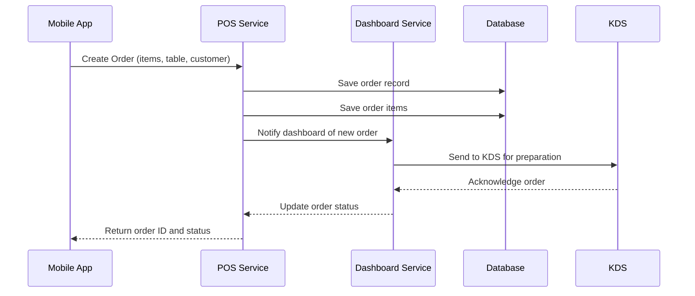
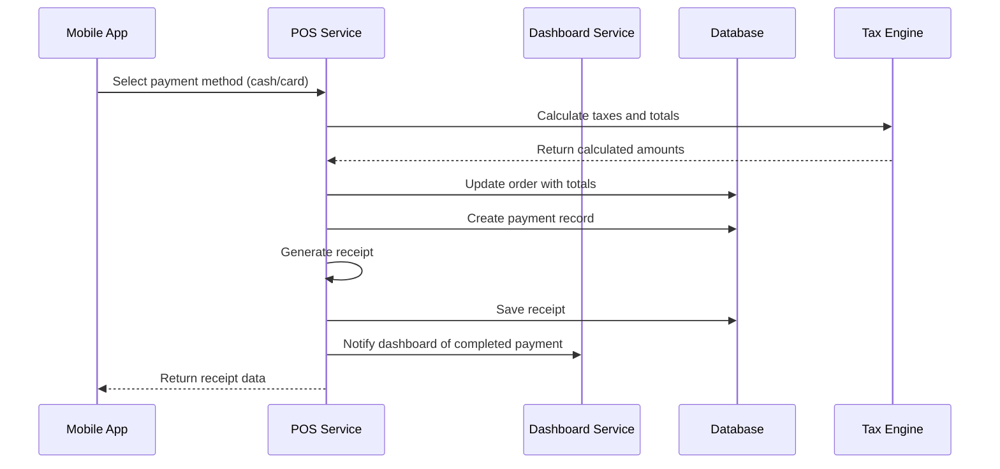
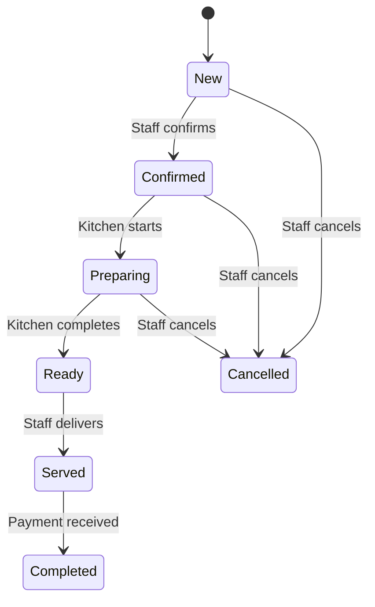

# Xseven POS Microservice Documentation

## Overview

The Xseven POS (Point of Sale) Microservice is a dedicated, mobile-optimized backend service designed specifically for small to medium-sized businesses (SMBs) in the hospitality industry. This standalone service enables staff to manage orders, select payment methods, generate receipts, and track order lifecycles while integrating seamlessly with the existing Xseven Analytics Dashboard Service.

### Key Principles

- **Mobile-First Design**: Optimized APIs for mobile app integration with responsive performance
- **Microservice Architecture**: Independent deployment and scaling capabilities
- **Seamless Integration**: Real-time communication with dashboard service via API gateway
- **Shared Database**: Leverages existing PostgreSQL schema for data consistency

## Current System Analysis

### Existing Backend Capabilities

#### 1. **Analytics Dashboard Service** (`/services/analytics-dashboard-service/`)
- **Framework**: FastAPI-based microservice
- **Database**: PostgreSQL with Supabase integration
- **Authentication**: JWT-based user authentication
- **Real-time**: WebSocket support for live updates

#### 2. **Core Modules Already Available**

**Table Management** (`app/models/operations.py`)
- Table status tracking (available, occupied, reserved, cleaning, maintenance)
- Table assignments and capacity management
- Floor plan integration
- Real-time occupancy tracking

**Kitchen Display System (KDS)** (`app/models/operations.py`)
- Order status flow (pending → preparing → ready → served → cancelled)
- Station-based order routing
- Preparation time tracking
- Staff assignment capabilities

**Menu Management** (`app/models/menu.py`)
- Hierarchical menu categories
- Menu items with pricing, descriptions, and modifiers
- Item variants and customization options
- Availability scheduling

**Inventory Management** (`app/models/inventory.py`)
- Stock level tracking with reorder points
- Transaction history and audit trails
- Supplier and location management
- Low stock alerts

**Staff Management** (`app/models/operations.py`)
- Employee scheduling and time tracking
- Role-based permissions
- Shift management with status tracking

#### 3. **Database Schema** (`shared/schemas/enterprise_dashboard_schema.sql`)
- Comprehensive tables for businesses, locations, menu items, inventory
- Existing relationships between tables, staff, and operations
- JSONB fields for flexible metadata storage

### Identified Gaps for POS Functionality

The current system lacks dedicated order management and billing capabilities:

1. **No Dedicated Order Entity**: Orders are handled through KDS but lack comprehensive lifecycle management
2. **No Payment Method Selection**: No way to record chosen payment methods
3. **No Receipt Generation**: Missing receipt creation with tax calculations
4. **No Tax Calculation Engine**: Tax rules not integrated with order processing
5. **No Customer Order History**: Limited customer profile linking to orders

## POS System Scope and Limitations

### What We're Building

✅ **Order Management**
- Create and track orders from initiation to completion
- Link orders to tables and customers
- Manage order items with modifiers and quantities
- Track order status through preparation workflow

✅ **Payment Method Selection**
- Staff selects "cash" or "card" for each order
- Records payment method without processing transactions
- Simple status tracking (pending → completed)

✅ **Receipt Generation**
- Generate digital receipts with full order details
- Include tax calculations and totals
- Support for printing and email distribution

✅ **Tax and Pricing**
- Apply location-specific tax rules (VAT, GST, sales tax)
- Support item-level and order-level discounts
- Multi-currency support for international businesses

✅ **Basic Customer Integration**
- Link orders to customer profiles
- Track customer order history for analytics

### What We're NOT Building

❌ **Payment Gateway Integration**: No Stripe, Square, or other payment processor connections
❌ **Real-time Transaction Processing**: No automated payment confirmation or refunds
❌ **Advanced Inventory Automation**: Basic stock deduction only
❌ **Complex Reporting**: Focus on essential sales and tax reports only

## System Architecture

### High-Level Architecture

```
┌─────────────────┐    ┌──────────────────┐    ┌─────────────────┐
│   Staff Interface │    │   Xseven POS     │    │   External      │
│   (Mobile/Web)    │◄──►│   Microservice   │◄──►│   Systems       │
└─────────────────┘    └──────────────────┘    └─────────────────┘
                                │                        │
                                ▼                        ▼
                       ┌──────────────────┐    ┌─────────────────┐
                       │   PostgreSQL     │    │   Standalone    │
                       │   Database       │    │   POS Terminal  │
                       └──────────────────┘    └─────────────────┘
                                │
                                ▼
                       ┌──────────────────┐
                       │   Dashboard      │
                       │   Service        │
                       └──────────────────┘
```

### Component Architecture

```
┌─────────────────────────────────────────────────────────────────┐
│                    Xseven Microservices Architecture           │
├─────────────────────────────────────────────────────────────────┤
│  ┌─────────────┐  ┌─────────────┐  ┌─────────────┐              │
│  │   Mobile    │  │   Web       │  │   API       │              │
│  │   App       │  │ Dashboard   │  │  Gateway    │              │
│  └─────────────┘  └─────────────┘  └─────────────┘              │
└─────────────────┬───────────────────────────────────────────────┘
                  │
        ┌─────────┴─────────┐
        │                   │
┌───────▼──────┐    ┌───────▼──────┐
│ POS Service  │    │ Dashboard    │
│              │    │ Service      │
│ - Orders     │    │ - Analytics  │
│ - Payments   │◄──►│ - Reports    │
│ - Receipts   │    │ - Tables     │
│ - Mobile API │    │ - KDS        │
└──────────────┘    └──────────────┘
        │                   │
        └───────────────────┘
             Shared DB
```

## Inter-Service Communication

### API Integration Strategy

**POS Service ↔ Dashboard Service**
- **Real-time Events**: WebSocket or HTTP callbacks for order status updates
- **Data Synchronization**: Shared database with read/write permissions
- **Authentication**: JWT tokens issued by auth service, validated by both services
- **Error Handling**: Circuit breakers and retry logic for resilient communication

### Mobile App Integration

**Optimized for Mobile Performance**
- Lightweight JSON responses for mobile bandwidth
- Pagination for large datasets (orders, receipts)
- Push notification support for order updates
- Offline queue for order creation when connectivity is poor

### 1. Order Management System

**Purpose**: Central hub for creating, tracking, and managing all orders from initiation to completion.

**Key Features**:
- Order creation with table/customer assignment
- Order item composition (menu items, quantities, modifiers)
- Status progression: `new` → `confirmed` → `preparing` → `ready` → `served` → `completed`
- Order history and audit trail
- Integration with existing KDS for kitchen workflow

**Dependencies**:
- Dashboard Service (for table/menu data via API calls)
- Shared Database (for order persistence)
- API Gateway (for routing and authentication)

### 2. Payment Method Selection

**Purpose**: Simple payment method tracking without transaction processing.

**Key Features**:
- Payment method selection: `cash` or `card`
- Payment status: `pending` → `completed` (when staff marks as paid)
- No external integrations required
- Manual handling confirmation

**Dependencies**:
- Order Management (payment linked to specific orders)
- Dashboard Service (for staff authentication)

### 3. Receipt Generation

**Purpose**: Create digital receipts for order confirmation and record-keeping.

**Key Features**:
- Generate receipts with complete order details
- Include tax calculations and totals
- Support multiple formats (JSON for API, PDF for printing)
- Store receipts for audit trails

**Dependencies**:
- Order Management (receipt based on order data)
- Tax Engine (for accurate calculations)
- Dashboard Service (for business settings)

### 4. Tax and Pricing Engine

**Purpose**: Apply location-specific tax rules to orders.

**Key Features**:
- Tax rule configuration per business location
- Support for multiple tax types (VAT, GST, sales tax)
- Item-level and order-level tax application
- Discount handling (item and order level)

**Dependencies**:
- Dashboard Service (for location and business settings)
- Shared Database (for tax rule storage)

### 5. Customer Integration

**Purpose**: Basic customer profile linking for order history and personalization.

**Key Features**:
- Customer profile creation and management
- Order-to-customer linking
- Basic loyalty tracking

**Dependencies**:
- Dashboard Service (for user management and authentication)

## Database Schema Additions

### New Tables Required

```sql
-- Orders Table
CREATE TABLE IF NOT EXISTS public.orders (
    id UUID PRIMARY KEY DEFAULT gen_random_uuid(),
    business_id UUID NOT NULL REFERENCES public.businesses(id) ON DELETE CASCADE,
    table_id UUID REFERENCES public.tables(id),
    customer_id UUID REFERENCES public.customers(id),
    status VARCHAR(50) NOT NULL DEFAULT 'new' CHECK (status IN ('new', 'confirmed', 'preparing', 'ready', 'served', 'completed', 'cancelled')),
    subtotal DECIMAL(10,2) NOT NULL DEFAULT 0,
    tax_amount DECIMAL(10,2) NOT NULL DEFAULT 0,
    discount_amount DECIMAL(10,2) DEFAULT 0,
    total_amount DECIMAL(10,2) NOT NULL DEFAULT 0,
    customer_count INTEGER DEFAULT 1,
    notes TEXT,
    staff_id UUID REFERENCES public.staff_members(id),
    created_at TIMESTAMPTZ DEFAULT now(),
    updated_at TIMESTAMPTZ DEFAULT now()
);

-- Order Items Table
CREATE TABLE IF NOT EXISTS public.order_items (
    id UUID PRIMARY KEY DEFAULT gen_random_uuid(),
    order_id UUID NOT NULL REFERENCES public.orders(id) ON DELETE CASCADE,
    menu_item_id UUID NOT NULL REFERENCES public.menu_items(id),
    quantity INTEGER NOT NULL CHECK (quantity > 0),
    unit_price DECIMAL(10,2) NOT NULL,
    subtotal DECIMAL(10,2) GENERATED ALWAYS AS (quantity * unit_price) STORED,
    modifiers JSONB DEFAULT '[]'::jsonb,
    notes TEXT,
    created_at TIMESTAMPTZ DEFAULT now()
);

-- Payments Table
CREATE TABLE IF NOT EXISTS public.payments (
    id UUID PRIMARY KEY DEFAULT gen_random_uuid(),
    order_id UUID NOT NULL REFERENCES public.orders(id) ON DELETE CASCADE,
    payment_method VARCHAR(20) NOT NULL CHECK (payment_method IN ('cash', 'card')),
    amount DECIMAL(10,2) NOT NULL,
    status VARCHAR(20) DEFAULT 'pending' CHECK (status IN ('pending', 'completed')),
    staff_id UUID REFERENCES public.staff_members(id),
    processed_at TIMESTAMPTZ DEFAULT now()
);

-- Receipts Table
CREATE TABLE IF NOT EXISTS public.receipts (
    id UUID PRIMARY KEY DEFAULT gen_random_uuid(),
    order_id UUID NOT NULL REFERENCES public.orders(id) ON DELETE CASCADE,
    receipt_number VARCHAR(100) UNIQUE NOT NULL,
    receipt_data JSONB NOT NULL, -- Complete receipt information
    generated_at TIMESTAMPTZ DEFAULT now(),
    generated_by UUID REFERENCES public.staff_members(id)
);

-- Tax Rules Table
CREATE TABLE IF NOT EXISTS public.tax_rules (
    id UUID PRIMARY KEY DEFAULT gen_random_uuid(),
    business_id UUID NOT NULL REFERENCES public.businesses(id) ON DELETE CASCADE,
    location_id UUID REFERENCES public.locations(id),
    name VARCHAR(100) NOT NULL,
    rate DECIMAL(5,4) NOT NULL, -- e.g., 0.10 for 10%
    type VARCHAR(20) NOT NULL CHECK (type IN ('vat', 'gst', 'sales_tax')),
    is_active BOOLEAN DEFAULT true,
    created_at TIMESTAMPTZ DEFAULT now()
);
```

### Relationships with Existing Tables

- `orders` → `tables` (many-to-one)
- `orders` → `customers` (many-to-one)
- `orders` → `staff_members` (many-to-one)
- `order_items` → `orders` (many-to-one)
- `order_items` → `menu_items` (many-to-one)
- `payments` → `orders` (one-to-one)
- `receipts` → `orders` (one-to-one)

### Core Endpoints (Mobile-Optimized)

#### Order Management
```
POST   /api/v1/pos/orders/              # Create new order (mobile-friendly)
GET    /api/v1/pos/orders/{order_id}    # Get order details (compact response)
PUT    /api/v1/pos/orders/{order_id}    # Update order status
GET    /api/v1/pos/orders/active        # List active orders (paginated)
GET    /api/v1/pos/orders/history       # Order history for staff (filtered)
DELETE /api/v1/pos/orders/{order_id}    # Cancel order
```

#### Payment Processing
```
POST   /api/v1/pos/payments/            # Record payment method
GET    /api/v1/pos/payments/{payment_id} # Get payment details
PUT    /api/v1/pos/payments/{payment_id} # Update payment status
GET    /api/v1/pos/orders/{order_id}/payment # Get payment status for order
```

#### Receipt Generation
```
POST   /api/v1/pos/receipts/            # Generate receipt
GET    /api/v1/pos/receipts/{receipt_id} # Get receipt data (mobile-optimized)
GET    /api/v1/pos/receipts/{receipt_id}/pdf # Download PDF receipt
GET    /api/v1/pos/orders/{order_id}/receipt # Get receipt for specific order
```

#### Mobile-Specific Endpoints
```
GET    /api/v1/pos/dashboard/summary    # Mobile dashboard summary
POST   /api/v1/pos/orders/offline       # Queue order for offline processing
GET    /api/v1/pos/notifications        # Push notification subscriptions
```

## Workflow Flows

### 1. Order Creation Flow (with Service Separation)



### 2. Payment and Receipt Flow (with Service Separation)



### 3. Order Status Progression



## Implementation Plan (Separate Microservice)

### Phase 1: Service Foundation (Week 1-2)
1. **Create POS Service Structure**
   - Set up new `/services/pos-service/` directory
   - Initialize FastAPI application with mobile-optimized middleware
   - Configure shared database connections and authentication

2. **Database Schema Integration**
   - Use existing tables from `shared/schemas/enterprise_dashboard_schema.sql`
   - Add POS-specific indexes for mobile performance
   - Set up database migrations for the new service

3. **Basic POS Models and APIs**
   - Create Pydantic models for orders, payments, receipts
   - Implement core endpoints with mobile-friendly responses
   - Add API versioning for future mobile app updates

### Phase 2: Dashboard Integration (Week 3-4)
1. **Inter-Service Communication**
   - Implement API calls to dashboard service for table/menu data
   - Set up WebSocket connections for real-time order updates
   - Add event-driven notifications between services

2. **Mobile API Optimization**
   - Optimize endpoints for mobile bandwidth and latency
   - Add pagination, filtering, and caching for large datasets
   - Implement push notification support for order status changes

3. **Tax and Receipt Engine**
   - Build tax calculation logic with location-based rules
   - Implement digital receipt generation (JSON + PDF support)
   - Add receipt storage and retrieval for mobile access

### Phase 3: Mobile App Integration & Testing (Week 5-6)
1. **Mobile API Development**
   - Create mobile-specific endpoints with lightweight responses
   - Implement offline order queuing for poor connectivity
   - Add real-time sync capabilities for order status updates

2. **Integration Testing**
   - Test inter-service communication and data consistency
   - Validate mobile app API performance and error handling
   - End-to-end testing of complete order-to-receipt workflow

3. **Performance and Security**
   - Load testing for mobile traffic patterns
   - Implement rate limiting and security best practices
   - Add monitoring and logging for mobile user experience

## Testing Strategy

### Unit Tests
- Individual component testing (order creation, tax calculation, receipt generation)
- Mock external dependencies (database, KDS)

### Integration Tests
- Full order lifecycle testing
- API endpoint testing with real database
- Cross-module interaction testing

### User Acceptance Testing
- Staff workflow simulation
- Receipt generation and printing testing
- Error scenario handling

## Assumptions and Requirements

### Technical Assumptions
- PostgreSQL database with JSONB support
- Python 3.11+ with FastAPI framework
- Existing authentication and authorization system
- WebSocket infrastructure for real-time updates

### Business Assumptions
- Target users: Small restaurants, cafes, retail shops (1-50 employees)
- Order volume: Up to 500 orders per day per location
- Payment methods: Cash and card only (manual processing)
- Tax compliance: Basic VAT/GST/sales tax for single jurisdiction

### Hardware Requirements
- Staff tablets or desktop computers for order entry
- Standard printers for receipt printing
- Standalone POS terminals for cash handling

## Future Enhancements

### Potential Phase 2 Features
- **Advanced Inventory Integration**: Real-time stock updates and automated reordering
- **Customer Loyalty Program**: Points and reward tracking
- **Advanced Reporting**: Detailed sales analytics and forecasting
- **Multi-location Management**: Centralized management for chains

### Integration Opportunities
- **Payment Gateway Connectors**: Add Stripe/Square integration if needed
- **Mobile Ordering**: Customer-facing mobile app integration
- **Third-party Delivery**: Integration with DoorDash, UberEats APIs

The Xseven POS Microservice provides a mobile-optimized, scalable solution for SMB order management and billing. By separating POS functionality into its own service, we enable independent scaling for mobile traffic, faster deployment cycles, and dedicated optimization for mobile user experiences.

The service integrates seamlessly with the existing dashboard service while maintaining data consistency through shared database access and real-time event communication. This architecture supports both current web dashboard users and future mobile app deployments.
