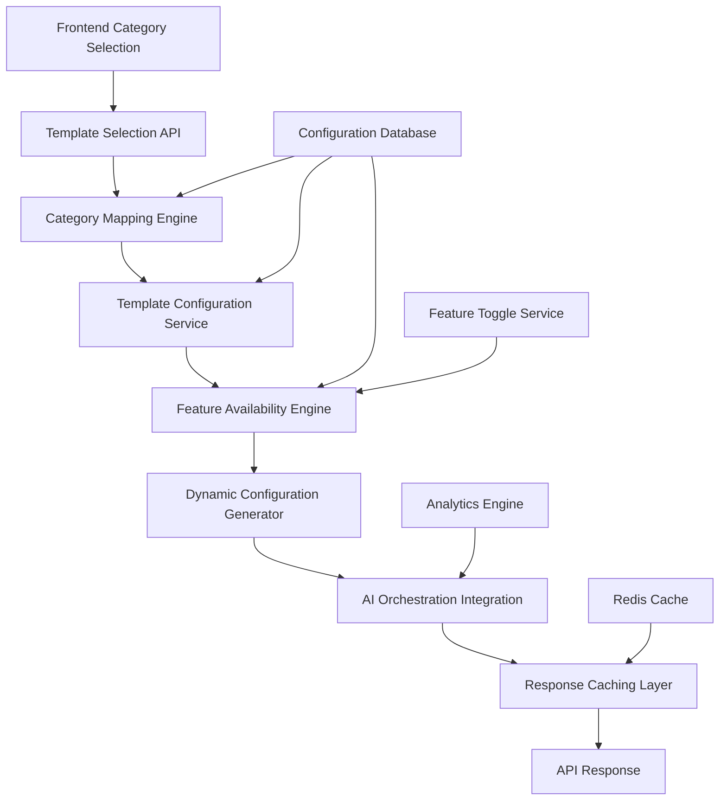

# 🏗️ **Template & Feature Selection Microservice - Enterprise Architecture**

## 📋 **Service Overview**

The **Template & Feature Selection Microservice** is a critical component that intelligently maps business categories to appropriate dashboard templates and dynamically configures available AI features. This service acts as the **"brain"** for template selection and feature provisioning.

---

## 🏛️ **Enterprise-Grade Architecture Design**

### **Core Architecture Components**



---

## 🔧 **Core Service Components**

### **1. Category Mapping Engine**
```python
class CategoryMappingEngine:
    """
    Enterprise-grade category-to-template mapping with ML-enhanced accuracy
    """

    def __init__(self):
        self.category_templates = {
            # Food & Hospitality Categories
            'restaurant': 'food_hospitality',
            'cafe': 'food_hospitality',
            'bar': 'food_hospitality',
            'catering': 'food_hospitality',
            'food_truck': 'food_hospitality',
            'bakery': 'food_hospitality',
            'pizza': 'food_hospitality',
            'fast_food': 'food_hospitality',

            # Service-Based Categories
            'salon': 'service_based',
            'spa': 'service_based',
            'barber': 'service_based',
            'nail_salon': 'service_based',
            'beauty': 'service_based',
            'fitness': 'service_based',
            'gym': 'service_based',
            'personal_trainer': 'service_based',
            'cleaning': 'service_based',
            'laundry': 'service_based',
            'pet_grooming': 'service_based',
            'car_wash': 'service_based',
            'home_service': 'service_based',
            'delivery': 'service_based',
            'tutoring': 'service_based',
            'consulting': 'service_based',

            # Retail & E-commerce Categories
            'retail': 'retail_ecommerce',
            'clothing': 'retail_ecommerce',
            'electronics': 'retail_ecommerce',
            'grocery': 'retail_ecommerce',
            'pharmacy': 'retail_ecommerce',
            'bookstore': 'retail_ecommerce',
            'sporting_goods': 'retail_ecommerce',
            'jewelry': 'retail_ecommerce',
            'furniture': 'retail_ecommerce',
            'automotive': 'retail_ecommerce',
            'ecommerce': 'retail_ecommerce',
            'marketplace': 'retail_ecommerce',

            # Professional Services Categories
            'law_firm': 'professional_services',
            'accounting': 'professional_services',
            'architecture': 'professional_services',
            'engineering': 'professional_services',
            'marketing_agency': 'professional_services',
            'advertising': 'professional_services',
            'software_development': 'professional_services',
            'web_development': 'professional_services',
            'graphic_design': 'professional_services',
            'photography': 'professional_services',
            'videography': 'professional_services',
            'real_estate': 'professional_services',
            'insurance': 'professional_services',
            'financial_services': 'professional_services',
            'healthcare': 'professional_services',
            'education': 'professional_services',
            'training': 'professional_services',
            'coaching': 'professional_services'
        }

        self.ml_enhancer = CategoryMLModel()
        self.confidence_scorer = ConfidenceScorer()

    async def map_category_to_template(self, category: str, business_context: dict) -> TemplateMapping:
        """
        Maps business category to template with ML-enhanced accuracy
        """
        # Primary mapping
        primary_template = self.category_templates.get(category.lower())

        if not primary_template:
            # ML-enhanced fallback mapping
            primary_template = await self.ml_enhancer.predict_template(category, business_context)

        # Calculate confidence score
        confidence = await self.confidence_scorer.calculate_confidence(
            category, primary_template, business_context
        )

        # Get alternative templates for edge cases
        alternatives = await self._get_alternative_templates(category, primary_template)

        return TemplateMapping(
            primary_template=primary_template,
            confidence_score=confidence,
            alternatives=alternatives,
            reasoning=f"Category '{category}' mapped to '{primary_template}' template"
        )
```

### **2. Template Configuration Service**
```python
class TemplateConfigurationService:
    """
    Manages template configurations and feature mappings
    """

    def __init__(self):
        self.template_configs = {
            'food_hospitality': {
                'name': 'Food & Hospitality',
                'description': 'Complete restaurant and hospitality management',
                'icon': '🍽️',
                'primary_color': '#FF6B35',
                'features': self._get_food_hospitality_features(),
                'api_endpoints': self._get_food_hospitality_endpoints(),
                'dashboard_widgets': self._get_food_hospitality_widgets()
            },
            'service_based': {
                'name': 'Service-Based',
                'description': 'Appointment and service delivery management',
                'icon': '✂️',
                'primary_color': '#4ECDC4',
                'features': self._get_service_based_features(),
                'api_endpoints': self._get_service_based_endpoints(),
                'dashboard_widgets': self._get_service_based_widgets()
            },
            'retail_ecommerce': {
                'name': 'Retail & E-commerce',
                'description': 'Retail sales and inventory management',
                'icon': '🛍️',
                'primary_color': '#45B7D1',
                'features': self._get_retail_ecommerce_features(),
                'api_endpoints': self._get_retail_ecommerce_endpoints(),
                'dashboard_widgets': self._get_retail_ecommerce_widgets()
            },
            'professional_services': {
                'name': 'Professional Services',
                'description': 'Project and client management',
                'icon': '💼',
                'primary_color': '#96CEB4',
                'features': self._get_professional_services_features(),
                'api_endpoints': self._get_professional_services_endpoints(),
                'dashboard_widgets': self._get_professional_services_widgets()
            }
        }

    def _get_food_hospitality_features(self) -> List[FeatureConfig]:
        return [
            FeatureConfig(
                id="ai_insight_engine",
                name="AI Insight Engine",
                type="universal",
                enabled=True,
                configuration={
                    "menu_analysis": True,
                    "customer_sentiment": True,
                    "operational_efficiency": True
                }
            ),
            FeatureConfig(
                id="predictive_intelligence",
                name="Predictive Intelligence",
                type="universal",
                enabled=True,
                configuration={
                    "demand_forecasting": True,
                    "staffing_optimization": True,
                    "inventory_prediction": True
                }
            ),
            FeatureConfig(
                id="smart_menu_optimizer",
                name="Smart Menu Optimizer",
                type="category_specific",
                enabled=True,
                configuration={
                    "performance_analysis": True,
                    "pricing_optimization": True,
                    "seasonal_recommendations": True
                }
            ),
            # ... additional features
        ]
```

### **3. Feature Availability Engine**
```python
class FeatureAvailabilityEngine:
    """
    Determines feature availability based on business context and licensing
    """

    def __init__(self):
        self.feature_toggle_service = FeatureToggleService()
        self.license_manager = LicenseManager()
        self.business_context_analyzer = BusinessContextAnalyzer()

    async def get_available_features(
        self,
        template: str,
        business_id: str,
        user_tier: str,
        customizations: dict = None
    ) -> List[AvailableFeature]:
        """
        Returns available features with their current configuration
        """
        # Get base template features
        template_features = await self.template_service.get_template_features(template)

        # Apply business-specific customizations
        contextual_features = await self.business_context_analyzer.enhance_features(
            template_features, business_id
        )

        # Apply license restrictions
        licensed_features = await self.license_manager.filter_by_license(
            contextual_features, user_tier
        )

        # Apply feature toggles
        toggled_features = await self.feature_toggle_service.apply_toggles(
            licensed_features, business_id
        )

        return toggled_features
```

### **4. Dynamic Configuration Generator**
```python
class DynamicConfigurationGenerator:
    """
    Generates real-time template configurations for frontend rendering
    """

    def __init__(self):
        self.template_renderer = TemplateRenderer()
        self.feature_configurator = FeatureConfigurator()
        self.cache_manager = ConfigurationCache()

    async def generate_template_config(
        self,
        category: str,
        business_context: dict,
        user_preferences: dict = None
    ) -> TemplateConfiguration:
        """
        Generates complete template configuration for frontend
        """
        # Map category to template
        template_mapping = await self.category_engine.map_category_to_template(
            category, business_context
        )

        # Get template configuration
        template_config = await self.template_service.get_template_config(
            template_mapping.primary_template
        )

        # Get available features
        available_features = await self.feature_engine.get_available_features(
            template_mapping.primary_template,
            business_context.get('business_id'),
            business_context.get('user_tier')
        )

        # Generate dynamic configuration
        dynamic_config = await self._generate_dynamic_config(
            template_config,
            available_features,
            user_preferences
        )

        # Cache configuration for performance
        await self.cache_manager.cache_configuration(
            category, business_context, dynamic_config
        )

        return dynamic_config

    async def _generate_dynamic_config(
        self,
        template_config: dict,
        features: List[AvailableFeature],
        preferences: dict
    ) -> TemplateConfiguration:
        """
        Generates the final configuration object for frontend
        """
        return TemplateConfiguration(
            template_id=template_config['id'],
            template_name=template_config['name'],
            template_description=template_config['description'],
            primary_color=template_config['primary_color'],
            icon=template_config['icon'],

            # Feature configuration
            features=features,
            enabled_features=[f for f in features if f.enabled],
            disabled_features=[f for f in features if not f.enabled],

            # UI Configuration
            dashboard_layout=self._generate_dashboard_layout(template_config, features),
            navigation_menu=self._generate_navigation_menu(template_config, features),
            widget_configurations=self._generate_widget_configs(template_config),

            # API Endpoints
            api_endpoints=template_config['api_endpoints'],
            webhook_endpoints=self._get_webhook_endpoints(template_config),

            # AI Integration
            ai_workflows=self._get_ai_workflows(template_config),
            automation_rules=self._get_automation_rules(template_config),

            # Metadata
            generated_at=datetime.utcnow(),
            version=template_config['version'],
            confidence_score=template_mapping.confidence_score
        )
```

---

## 🚀 **API Endpoints Design**

### **Core Template Selection Endpoints**

```python
# app/routes/template_selection.py
from fastapi import APIRouter, HTTPException, Depends
from pydantic import BaseModel
from typing import List, Dict, Any, Optional

router = APIRouter(prefix="/api/v1/template-selection", tags=["template-selection"])

class CategorySelectionRequest(BaseModel):
    """Request for template selection based on category"""
    category: str
    business_name: str
    business_description: Optional[str] = None
    industry_keywords: List[str] = []
    business_size: str = "small"  # small, medium, large, enterprise
    user_tier: str = "basic"  # basic, premium, enterprise

class TemplateConfigurationResponse(BaseModel):
    """Complete template configuration response"""
    template_id: str
    template_name: str
    template_description: str
    primary_color: str
    icon: str

    features: List[FeatureConfig]
    enabled_features: List[FeatureConfig]
    disabled_features: List[FeatureConfig]

    dashboard_layout: Dict[str, Any]
    navigation_menu: List[NavigationItem]
    widget_configurations: Dict[str, Any]

    api_endpoints: Dict[str, str]
    webhook_endpoints: Dict[str, str]

    ai_workflows: List[AIWorkflow]
    automation_rules: List[AutomationRule]

    generated_at: str
    version: str
    confidence_score: float

@router.post("/select", response_model=TemplateConfigurationResponse)
async def select_template_configuration(
    request: CategorySelectionRequest,
    current_user: dict = Depends(get_current_user)
):
    """
    Select and configure template based on business category

    This endpoint serves as the primary interface for template selection,
    intelligently mapping business categories to appropriate templates
    and configuring all associated features and settings.
    """
    try:
        # Build business context
        business_context = {
            'business_id': current_user.get('business_id'),
            'user_id': current_user.get('user_id'),
            'user_tier': request.user_tier,
            'business_size': request.business_size,
            'category': request.category,
            'business_name': request.business_name,
            'business_description': request.business_description,
            'industry_keywords': request.industry_keywords
        }

        # Generate template configuration
        config_generator = DynamicConfigurationGenerator()
        template_config = await config_generator.generate_template_config(
            category=request.category,
            business_context=business_context,
            user_preferences=current_user.get('preferences')
        )

        # Log template selection for analytics
        await log_template_selection(
            business_id=business_context['business_id'],
            category=request.category,
            selected_template=template_config.template_id,
            confidence_score=template_config.confidence_score
        )

        return template_config

    except Exception as e:
        logger.error(f"Template selection error: {e}", exc_info=True)
        raise HTTPException(status_code=500, detail="Failed to select template configuration")

@router.get("/categories")
async def get_available_categories():
    """Get all available business categories with their metadata"""
    category_service = CategoryService()
    return await category_service.get_all_categories_with_metadata()

@router.get("/templates")
async def get_available_templates():
    """Get all available templates with their feature sets"""
    template_service = TemplateService()
    return await template_service.get_all_templates_with_features()

@router.post("/preview")
async def preview_template_configuration(
    request: CategorySelectionRequest
):
    """
    Preview template configuration without applying it

    Useful for frontend to show template previews before selection
    """
    config_generator = DynamicConfigurationGenerator()

    # Generate configuration without caching
    template_config = await config_generator.generate_template_config(
        category=request.category,
        business_context={
            'user_tier': request.user_tier,
            'business_size': request.business_size,
            'category': request.category
        }
    )

    return {
        'preview': True,
        'template_config': template_config,
        'estimated_setup_time': '5-10 minutes',
        'required_integrations': template_config.get('required_integrations', [])
    }

@router.post("/customize")
async def customize_template_features(
    template_id: str,
    feature_customizations: Dict[str, Any],
    current_user: dict = Depends(get_current_user)
):
    """
    Customize template features for specific business needs

    Allows businesses to enable/disable specific features
    and configure feature parameters
    """
    customization_service = TemplateCustomizationService()

    customized_config = await customization_service.customize_features(
        template_id=template_id,
        business_id=current_user['business_id'],
        customizations=feature_customizations
    )

    return customized_config
```

---

## 🔗 **Integration with AI Orchestration Service**

### **Workflow Integration**
```python
class TemplateAIIntegration:
    """
    Seamlessly integrates template selection with AI orchestration workflows
    """

    def __init__(self):
        self.ai_orchestrator = AIOrchestrationService()
        self.template_service = TemplateSelectionService()

    async def initialize_business_with_template(
        self,
        business_id: str,
        template_config: TemplateConfiguration,
        initial_data: dict = None
    ) -> dict:
        """
        Initialize business with selected template and AI workflows
        """
        # Step 1: Set up template-specific AI workflows
        await self._setup_template_workflows(business_id, template_config)

        # Step 2: Initialize AI agents for the template
        await self._initialize_template_agents(business_id, template_config)

        # Step 3: Configure RAG knowledge base for the template
        await self._setup_template_knowledge_base(business_id, template_config)

        # Step 4: Set up automation workflows
        await self._configure_automation_workflows(business_id, template_config)

        # Step 5: Initialize dashboard with template data
        dashboard_config = await self._initialize_dashboard(business_id, template_config)

        return {
            'status': 'initialized',
            'business_id': business_id,
            'template_id': template_config.template_id,
            'ai_workflows_configured': True,
            'dashboard_ready': True,
            'next_steps': self._get_onboarding_steps(template_config)
        }

    async def _setup_template_workflows(self, business_id: str, template_config: TemplateConfiguration):
        """Set up LangGraph workflows specific to the template"""
        workflow_configs = template_config.ai_workflows

        for workflow_config in workflow_configs:
            await self.ai_orchestrator.create_workflow(
                business_id=business_id,
                workflow_type=workflow_config.type,
                configuration=workflow_config.settings
            )

    async def _initialize_template_agents(self, business_id: str, template_config: TemplateConfiguration):
        """Initialize CrewAI agents for template-specific tasks"""
        agent_configs = template_config.agent_configurations

        for agent_config in agent_configs:
            await self.ai_orchestrator.initialize_agent(
                business_id=business_id,
                agent_type=agent_config.type,
                capabilities=agent_config.capabilities
            )
```

---

## ⚡ **Performance & Scalability Features**

### **Advanced Caching Strategy**
```python
class ConfigurationCache:
    """
    Multi-layer caching for optimal performance
    """

    def __init__(self):
        # Layer 1: In-memory cache for active configurations
        self.memory_cache = TTLCache(maxsize=1000, ttl=300)

        # Layer 2: Redis cache for distributed configurations
        self.redis_cache = RedisCache()

        # Layer 3: Database cache for persistent configurations
        self.db_cache = ConfigurationDatabase()

    async def get_configuration(self, cache_key: str) -> Optional[TemplateConfiguration]:
        """Get configuration with multi-layer cache fallback"""
        # Try memory cache first
        config = self.memory_cache.get(cache_key)
        if config:
            return config

        # Try Redis cache
        config = await self.redis_cache.get(cache_key)
        if config:
            # Populate memory cache
            self.memory_cache[cache_key] = config
            return config

        # Try database cache
        config = await self.db_cache.get(cache_key)
        if config:
            # Populate both caches
            self.memory_cache[cache_key] = config
            await self.redis_cache.set(cache_key, config)
            return config

        return None

    async def cache_configuration(
        self,
        category: str,
        business_context: dict,
        configuration: TemplateConfiguration
    ):
        """Cache configuration across all layers"""
        cache_key = self._generate_cache_key(category, business_context)

        # Set in all cache layers
        self.memory_cache[cache_key] = configuration
        await self.redis_cache.set(cache_key, configuration, ttl=3600)  # 1 hour
        await self.db_cache.set(cache_key, configuration, ttl=86400)  # 24 hours
```

### **Feature Toggle System**
```python
class FeatureToggleService:
    """
    Real-time feature toggling for dynamic configuration
    """

    def __init__(self):
        self.toggle_store = FeatureToggleStore()
        self.business_context_manager = BusinessContextManager()

    async def apply_toggles(
        self,
        features: List[FeatureConfig],
        business_id: str
    ) -> List[FeatureConfig]:
        """Apply feature toggles based on business context"""
        toggled_features = []

        for feature in features:
            # Check if feature is toggled for this business
            toggle_state = await self.toggle_store.get_toggle_state(
                feature_id=feature.id,
                business_id=business_id
            )

            if toggle_state is not None:
                # Override feature enabled state
                feature.enabled = toggle_state

            # Apply business context modifications
            contextual_feature = await self.business_context_manager.modify_feature(
                feature, business_id
            )

            toggled_features.append(contextual_feature)

        return toggled_features
```

---

## 📊 **Analytics & Monitoring Integration**

### **Template Selection Analytics**
```python
class TemplateAnalyticsEngine:
    """
    Comprehensive analytics for template selection and usage
    """

    async def track_template_selection(
        self,
        business_id: str,
        category: str,
        selected_template: str,
        confidence_score: float,
        selection_context: dict
    ):
        """Track template selection for analytics and optimization"""
        analytics_event = {
            'event_type': 'template_selection',
            'business_id': business_id,
            'category': category,
            'selected_template': selected_template,
            'confidence_score': confidence_score,
            'selection_context': selection_context,
            'timestamp': datetime.utcnow(),
            'user_agent': selection_context.get('user_agent'),
            'session_id': selection_context.get('session_id')
        }

        # Send to analytics pipeline
        await self.analytics_publisher.publish(analytics_event)

        # Update ML model for continuous improvement
        await self.ml_optimizer.update_model(
            category=category,
            selected_template=selected_template,
            confidence_score=confidence_score,
            context=selection_context
        )

    async def track_feature_usage(
        self,
        business_id: str,
        feature_id: str,
        usage_metrics: dict
    ):
        """Track feature usage for optimization"""
        usage_event = {
            'event_type': 'feature_usage',
            'business_id': business_id,
            'feature_id': feature_id,
            'usage_metrics': usage_metrics,
            'timestamp': datetime.utcnow()
        }

        await self.analytics_publisher.publish(usage_event)
```

---

## 🔒 **Enterprise Security Features**

### **Configuration Security**
```python
class ConfigurationSecurityManager:
    """
    Enterprise-grade security for template configurations
    """

    def __init__(self):
        self.encryption_service = ConfigurationEncryption()
        self.access_control = TemplateAccessControl()
        self.audit_logger = ConfigurationAuditLogger()

    async def secure_configuration(
        self,
        configuration: TemplateConfiguration,
        business_id: str,
        user_id: str
    ) -> SecuredTemplateConfiguration:
        """Apply security measures to configuration"""

        # Encrypt sensitive configuration data
        encrypted_config = await self.encryption_service.encrypt_configuration(
            configuration, business_id
        )

        # Apply access control rules
        access_controlled_config = await self.access_control.apply_access_rules(
            encrypted_config, business_id, user_id
        )

        # Log configuration access for audit
        await self.audit_logger.log_configuration_access(
            configuration_id=configuration.template_id,
            business_id=business_id,
            user_id=user_id,
            action='configuration_generated'
        )

        return access_controlled_config
```

---

## 🚀 **Implementation Benefits**

### **🎯 Technical Excellence**
- **Microservices Architecture** - Modular, scalable, maintainable
- **Real-time Configuration** - Dynamic template and feature selection
- **Advanced Caching** - Multi-layer caching for optimal performance
- **ML-Enhanced Mapping** - Continuous improvement through machine learning

### **💼 Business Impact**
- **Instant Template Selection** - <100ms response time for template selection
- **Personalized Experience** - Template and features tailored to business needs
- **Scalable Architecture** - Supports thousands of concurrent template selections
- **Future-Proof Design** - Easy to add new templates and features

### **🔧 Operational Benefits**
- **Zero-Downtime Updates** - Feature toggles allow live configuration changes
- **Comprehensive Analytics** - Detailed insights into template selection and usage
- **Enterprise Security** - Bank-grade security for configuration data
- **Audit Compliance** - Complete audit trail for all configuration changes

This **Template & Feature Selection Microservice** serves as the **intelligent backbone** that powers X-sevenAI's dynamic, personalized business automation platform, delivering the perfect template configuration for every business type with enterprise-grade performance and reliability.
