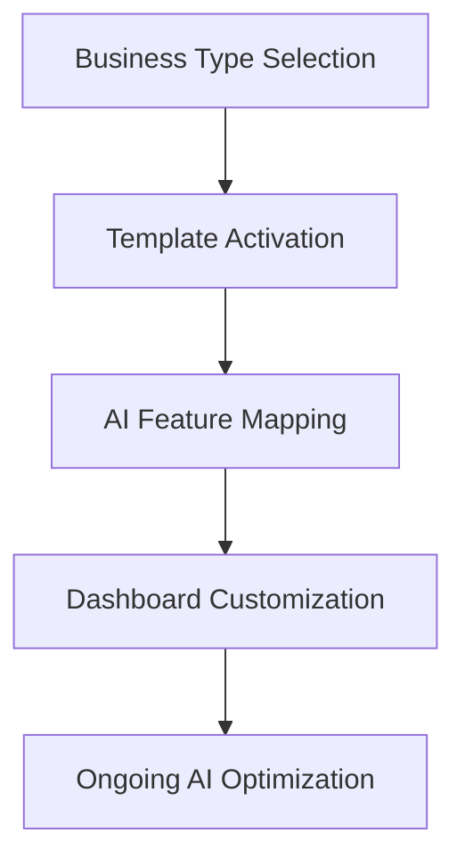
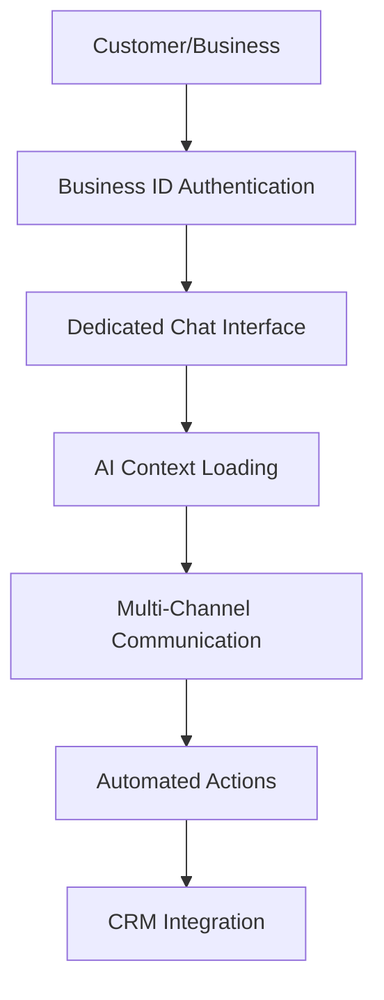
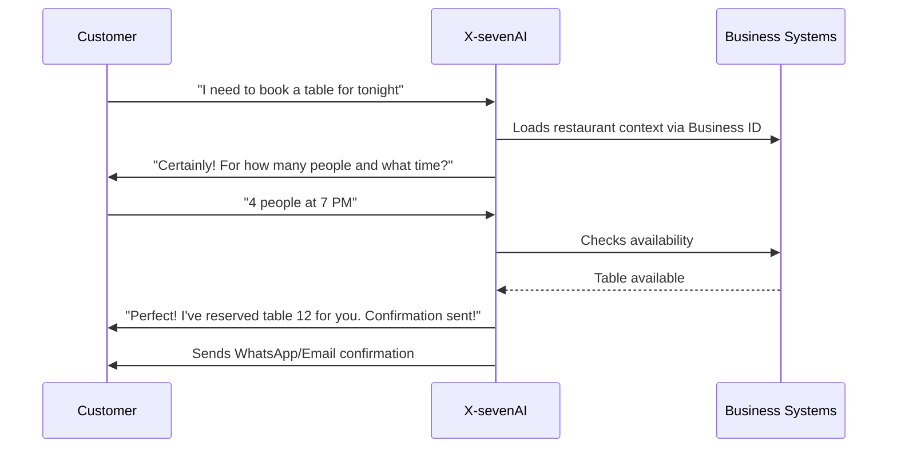
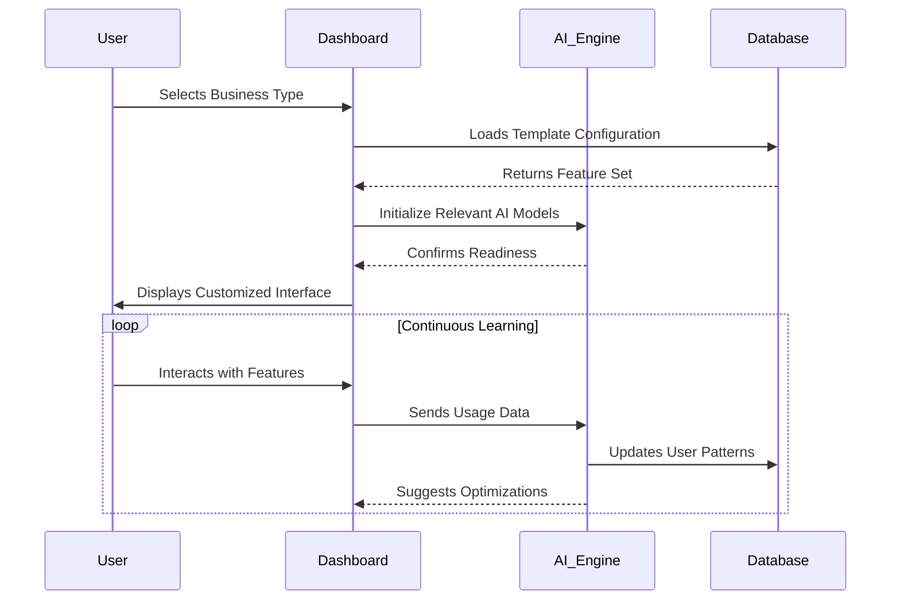
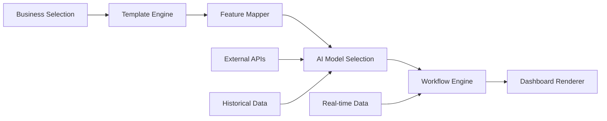

# X-sevenAI: Business-Specific AI Features Dashboard

## 🌟 Overview
X-sevenAI's intelligent dashboard adapts to your business type, delivering AI-powered insights tailored to your industry. This document details the AI features available across our four main business templates.

## 🎨 Template Comparison Matrix

| Feature Category | 🍽️ Food & Hospitality | ✂️ Service-Based | 🛍️ Retail & E-commerce | 💼 Professional Services |
|-----------------|----------------------|------------------|------------------------|--------------------------|
| **Core Analytics** | ✅ | ✅ | ✅ | ✅ |
| **Menu/Service Optimization** | ✅ Menu Engineering | ✅ Service Packages | ✅ Product Recommendations | ✅ Service Pricing |
| **Scheduling** | ✅ Table Management | ✅ Appointment Booking | ✅ Staff Scheduling | ✅ Project Timeline |
| **Inventory** | ✅ Perishable Goods | ✅ Supplies Tracking | ✅ Stock Management | ✅ Resource Allocation |
| **Customer Insights** | ✅ Dining Patterns | ✅ Client History | ✅ Buying Behavior | ✅ Project History |
| **AI Forecasting** | ✅ Demand Prediction | ✅ Booking Trends | ✅ Sales Projections | ✅ Revenue Forecasting |

## 🍽️ 1. Food & Hospitality Template

### 🔍 Key AI Features

#### Smart Menu Optimizer
- **Menu Engineering**
  - Identifies high/low profit items with margin analysis
  - Suggests menu layout changes based on eye-tracking heatmaps
  - Seasonal menu recommendations using local ingredient availability
  - Dynamic pricing for specials and happy hours

#### Kitchen Command Center
- **Operations Intelligence**
  - Smart order routing to optimize cook times
  - Real-time cook time prediction with staff alerts
  - Ingredient usage tracking with auto-replenishment
  - Waste reduction analytics

#### Intelligent Seating & Flow
- **Customer Experience AI**
  - Real-time wait time predictions with 95% accuracy
  - Reservation optimization to maximize table turnover
  - Weather-aware menu suggestions (e.g., hot drinks on rainy days)
  - Automated review sentiment analysis

#### Staffing Intelligence
- **Smart Staff Scheduler**
  - Uses predicted demand to auto-generate optimal shift rosters
  - Performance tracking based on table turnover and customer feedback
  - Automated break scheduling to maintain service quality

#### Inventory & Supply Chain
- **Ingredient Inventory Predictor**
  - Predicts ingredient usage and expiration, sends reorder alerts
  - Supplier performance tracking and cost optimization
  - Food cost percentage monitoring with automated adjustments

**Automation Examples:**
- "If cold weather predicted → promote soup & hot coffee via SMS."
- "If food cost % > target → adjust ingredient supplier mix."

## ✂️ 2. Service-Based Business Template

### ✨ Signature Features

#### AI Booking Optimizer
- **Intelligent Scheduling**
  - Predicts peak times and suggests optimal booking slots
  - No-show prediction identifies clients likely to cancel, sends auto-reminders
  - Staff-client matching based on skill and preference
  - Automated waitlist management

#### Client Retention Engine
- **Personalized Care AI**
  - Service history tracking with personalized recommendations
  - Automated follow-ups and rebooking reminders
  - Loyalty program optimization with smart rewards
  - Client lifetime value prediction

#### Smart Upsell Recommender
- **Revenue Optimization**
  - Suggests complementary services (e.g., "Facial + Hair Spa Combo")
  - Package recommendations based on client history
  - Seasonal service suggestions
  - Pricing strategy optimization

#### Customer Mood Tracking
- **Sentiment Intelligence**
  - Uses NLP from reviews to gauge sentiment trends
  - Automated response system for negative feedback
  - Positive review amplification on social media

#### Staff Performance Tracker
- **Team Intelligence**
  - AI evaluates staff performance based on feedback and repeat clients
  - Identifies training opportunities
  - Optimizes staff scheduling based on performance

**Automation Examples:**
- "If a client books >3 times → auto-send loyalty voucher."
- "If salon traffic low this week → run 20% off ad for repeat clients."

## 🛍️ 3. Retail & E-commerce Template

### 🚀 Advanced Capabilities

#### AI Restock Forecaster
- **Inventory Intelligence**
  - Predicts optimal reorder timing and supplier costs
  - Uses sales velocity patterns and seasonality
  - Automated reorder triggers based on stock levels
  - Supplier performance scoring and recommendations

#### Dynamic Discount Engine
- **Pricing Optimization**
  - Adjusts prices automatically based on slow-moving SKUs
  - Holiday and seasonal pricing strategies
  - Competitor price monitoring and response
  - Margin optimization algorithms

#### Abandoned Cart Recovery
- **Customer Retention AI**
  - AI drafts personalized messages/emails with offer suggestions
  - Timing optimization for follow-up communications
  - A/B testing for message effectiveness

#### Product Trend Predictor
- **Market Intelligence**
  - Uses social media + Google Trends to identify products about to spike
  - Local demand forecasting based on demographics
  - New product launch success prediction

#### Inventory Intelligence
- **Automated Replenishment**
  - Smart restocking alerts with lead time consideration
  - Dead stock identification and clearance recommendations
  - Supplier performance tracking and cost optimization

**Automation Examples:**
- "If product X inventory < 10 → auto reorder from supplier Y."
- "If Google Trends ↑ 30% for 'winter jacket' → increase ad spend by 20%."

## 💼 4. Professional Services Template

### 🎯 Business Growth Tools

#### Project Profitability Analyzer
- **Financial Intelligence**
  - AI calculates true profit margin per job considering travel + labor + material costs
  - Billable hour tracking with efficiency analysis
  - Project risk assessment with early warning systems

#### Smart Quote Generator
- **Pricing Optimization**
  - Auto-creates dynamic service quotes using past data + demand forecast
  - Competitor pricing analysis and positioning
  - Profit margin optimization based on client history

#### Client Value Analysis
- **Relationship Intelligence**
  - Client profitability scoring and lifetime value prediction
  - Engagement tracking with retention risk assessment
  - Upsell opportunities identification and timing

#### Resource Allocation AI
- **Team Optimization**
  - Optimizes team workload and skill matching
  - Forecasts staffing needs based on project pipeline
  - Performance analytics with improvement recommendations

#### Client Review Monitor
- **Reputation Management**
  - Tracks reviews to auto-respond and improve SEO ranking
  - Sentiment analysis with trend identification
  - Automated testimonial requests for satisfied clients

## 🤖 Dedicated AI Chat & Communication Hub

### **Unified Communication Layer**
The X-sevenAI system features a **dedicated chat interface** that serves as the central command center for all business operations, powered by advanced AI that understands your business context from the moment you connect via your unique **Business ID**.

### **Multi-Channel Communication Management**
The AI seamlessly manages all customer touchpoints:

#### 📱 **Instagram Integration**
- **Automated DM Responses** with business-specific context
- **Story Monitoring** for mentions and engagement opportunities
- **Post Scheduling** with AI-generated content suggestions
- **Customer Inquiry Routing** to appropriate team members

#### 📧 **Email Automation**
- **Smart Email Campaigns** tailored to customer segments
- **Automated Follow-ups** based on customer behavior
- **Review Request Management** with personalized timing
- **Newsletter Generation** with industry-specific content

#### 💬 **WhatsApp Business API**
- **24/7 Customer Service** with instant responses
- **Order Status Updates** via WhatsApp notifications
- **Appointment Reminders** and confirmations
- **Promotional Messages** with opt-in management

#### 📞 **WebRTC Voice**
- **Click-to-Call** functionality from chat interface
- **Call Recording & Transcription** for quality assurance

### **Category-Specific Booking & Service Management**

#### 🍽️ **Food & Hospitality Automation**
**Reservation Management:**
- *"Reserve a table for 4 at 7 PM" → Instant booking confirmation*
- *"What's your availability for tomorrow?" → Real-time slot display*
- *"Cancel my reservation" → Automated cancellation with confirmation*

**Order Processing:**
- *"I'd like to order 2 pizzas for delivery" → Complete order capture*
- *"Add extra cheese to my usual order" → Personalized order modification*
- *"Track my delivery" → Real-time order status updates*

#### ✂️ **Service-Based Business Automation**
**Appointment Booking:**
- *"Book a haircut for tomorrow at 2 PM" → Instant scheduling*
- *"Reschedule my appointment" → Intelligent rescheduling options*
- *"What's included in the premium package?" → Service detail explanation*

**Service Recommendations:**
- *"I need a facial, what do you recommend?" → AI-powered suggestions*
- *"Show me before and after photos" → Media gallery integration*

#### 🛍️ **Retail & E-commerce Automation**
**Product Inquiries:**
- *"Do you have this in medium size?" → Inventory check & alternatives*
- *"What's the price of the blue dress?" → Real-time pricing & promotions*
- *"Can you hold this item for me?" → Automated hold requests*

**Order Management:**
- *"Place an order for pickup" → Complete transaction processing*
- *"Track my package" → Real-time shipping updates*
- *"Return policy information" → Automated policy explanation*

#### 💼 **Professional Services Automation**
**Consultation Booking:**
- *"Schedule a 30-minute consultation" → Calendar integration*
- *"What's your availability next week?" → Free slot identification*
- *"Send me a proposal" → Automated document generation*

**Project Management:**
- *"Update project status" → Real-time progress tracking*
- *"Schedule a team meeting" → Multi-party scheduling*

#### 🏋️ **Gyms & Fitness Automation**
**Class Booking:**
- *"Sign me up for tomorrow's yoga class" → Instant registration*
- *"What's the class schedule for this week?" → Complete timetable display*
- *"Cancel my membership" → Automated cancellation process*

**Personal Training:**
- *"Book a session with trainer John" → Staff availability matching*
- *"Track my progress" → Personalized fitness analytics*

#### 🧰 **Service Businesses Automation**
**Service Requests:**
- *"Fix my leaking faucet" → Job scheduling and quoting*
- *"Schedule a cleaning service" → Availability and pricing*
- *"Emergency repair needed" → Priority routing*

**Quote Management:**
- *"Send me a quote for lawn mowing" → Automated quote generation*
- *"Compare service packages" → Side-by-side comparison*

### **AI Context Intelligence**

#### **Business ID-Powered Personalization**
- **Instant Context Loading:** AI recognizes business type, location, operating hours
- **Customer History Integration:** Pulls previous interactions and preferences
- **Real-Time Availability:** Checks current inventory, staff, and scheduling
- **Multi-Language Support:** Responds in customer's preferred language

#### **Smart Conversation Flow**

### **Advanced AI Capabilities**

#### **Natural Language Processing**
- **Intent Recognition:** Understands booking requests, inquiries, complaints
- **Sentiment Analysis:** Detects urgency and adjusts response tone
- **Entity Extraction:** Identifies dates, times, products, services
- **Context Preservation:** Maintains conversation flow across channels

#### **Automated Actions & Integrations**
- **CRM Updates:** Automatically logs all interactions
- **Calendar Integration:** Syncs bookings with business calendars
- **Payment Processing:** Handles deposits and payments
- **Notification Systems:** Multi-channel confirmations and reminders

#### **Business Intelligence Integration**
- **Performance Tracking:** Monitors conversion rates by channel
- **Customer Insights:** Builds profiles from interaction history
- **Revenue Attribution:** Tracks bookings to original inquiry source
- **Optimization Suggestions:** AI recommends improvements based on patterns

### **Security & Privacy Features**
- **End-to-End Encryption:** All communications are secure
- **GDPR Compliance:** Data handling meets privacy regulations
- **Opt-in Management:** Customers control communication preferences
- **Audit Trails:** Complete logs for compliance and training

### **Implementation Benefits**
- **24/7 Availability:** Never miss a customer inquiry
- **Consistent Service:** Standardized responses across all channels
- **Scalability:** Handle unlimited concurrent conversations
- **Cost Efficiency:** Reduce staffing needs for routine inquiries
- **Revenue Growth:** Capture more bookings and orders

This unified communication layer transforms your business into an AI-powered operation center, where every customer interaction becomes an opportunity for engagement, booking, and growth.

### 🤖 AI Copilot Chat Shortcuts
**Pre-trained Intelligence**
- **Industry-Specific Prompts**: Pre-built conversation starters for each business category's jargon & metrics
- **Quick Commands**: "Show me last week's sales" or "How's my inventory looking?"
- **Context-Aware Responses**: AI understands your business type and provides relevant insights

### 📊 Benchmark Insights
**Comparative Intelligence**
- **Local Competition**: Compare metrics vs local competitors (e.g., "Your revenue per customer is 15% higher than city average")
- **Industry Standards**: Benchmark against industry averages and best practices
- **Performance Tracking**: Monitor improvement over time with percentile rankings

### 🎯 Goal-Oriented Mode
**Achievement Intelligence**
- **Smart Goal Setting**: User sets goals ("Increase revenue by 10%") → AI designs a multi-step plan
- **Progress Tracking**: Automated monitoring with milestone celebrations
- **Adaptive Strategies**: AI adjusts recommendations based on goal progress

### 💰 Customer Lifetime Value (CLV) Predictor
**Value Intelligence**
- **Customer Scoring**: Predicts future value of each customer across all business types
- **Retention Strategies**: Identifies at-risk high-value customers with personalized retention plans
- **Growth Opportunities**: Highlights customers with high growth potential

### 🌱 Sustainability Scorecard
**Eco-Efficiency Intelligence**
- **Resource Tracking**: Monitor energy/waste metrics across operations
- **AI Suggestions**: Recommends eco-efficiency improvements with ROI projections
- **Sustainability Reporting**: Automated reports for compliance and marketing

## 🏋️ 5. Gyms, Fitness Studios & Wellness Centers Template

### 💪 Member-Centric Intelligence

#### Churn Predictor
- **Retention Intelligence**
  - Identifies inactive members and suggests re-engagement offers
  - Automated motivational messaging for at-risk members
  - Personalized class recommendations based on attendance patterns

#### Class Occupancy Forecaster
- **Schedule Optimization**
  - Predicts busy times to balance bookings and capacity
  - Suggests optimal class times based on member preferences
  - Automated waitlist management and overflow handling

#### Trainer Performance Analytics
- **Team Intelligence**
  - AI measures class ratings, attendance, and conversion from trials → memberships
  - Identifies top-performing instructors and training opportunities
  - Automated feedback collection and analysis

#### Personalized Training Suggestions
- **Member Experience AI**
  - Recommends classes/workouts to clients via AI chat based on goals and history
  - Progress tracking with adaptive program suggestions
  - Injury prevention alerts based on usage patterns

#### Wellness Trend Watcher
- **Market Intelligence**
  - Tracks rising fitness trends locally and suggests new classes
  - Social media monitoring for popular workout styles
  - Competitor analysis for program differentiation

**Automation Examples:**
- "If member inactive 14 days → auto-send motivational message + 10% class discount."
- "If new yoga trend emerging → suggest adding to next week's schedule."

## 🧰 6. Service Businesses Template (Repair, Cleaning, Freelancers)

### 🔧 Operational Excellence Intelligence

#### AI Route Optimizer
- **Logistics Intelligence**
  - Creates best travel routes for field workers using Google Maps API
  - Considers traffic patterns, job duration, and fuel efficiency
  - Real-time route adjustments for emergencies or delays

#### Job Profitability Analyzer
- **Financial Intelligence**
  - AI calculates true profit margin per job considering travel + labor + material costs
  - Identifies high-profit vs. low-profit service types
  - Suggests pricing adjustments based on demand and costs

#### Smart Quote Generator
- **Pricing Intelligence**
  - Auto-creates dynamic service quotes using past data + demand forecast
  - Factors in seasonal demand, competitor pricing, and material costs
  - A/B testing for quote acceptance rates

#### Client Review Monitor
- **Reputation Intelligence**
  - Tracks reviews across platforms to auto-respond and improve SEO ranking
  - Sentiment analysis with trend identification
  - Automated testimonial requests for satisfied clients

#### Predictive Maintenance Alerts
- **Proactive Service Intelligence**
  - For recurring service clients (e.g., "Recommend next cleaning in 2 weeks")
  - Equipment failure prediction for repair services
  - Automated scheduling for preventive maintenance

**Automation Examples:**
- "If customer rating <4 → AI sends follow-up apology + discount coupon."
- "If high-demand zone detected → auto-assign more staff or increase service fee."

## 🎨 Template Comparison Matrix (6 Business Types)

| Feature Category | 🍽️ Food & Hospitality | ✂️ Service-Based | 🛍️ Retail & E-commerce | 💼 Professional Services | 🏋️ Gyms & Fitness | 🧰 Service Businesses |
|-----------------|----------------------|------------------|------------------------|--------------------------|-------------------|---------------------|
| **Core Analytics** | ✅ | ✅ | ✅ | ✅ | ✅ | ✅ |
| **Menu/Service Optimization** | ✅ Menu Engineering | ✅ Service Packages | ✅ Product Recommendations | ✅ Service Pricing | ✅ Class Recommendations | ✅ Quote Generation |
| **Scheduling** | ✅ Table Management | ✅ Appointment Booking | ✅ Staff Scheduling | ✅ Project Timeline | ✅ Class Scheduling | ✅ Route Optimization |
| **Inventory** | ✅ Perishable Goods | ✅ Supplies Tracking | ✅ Stock Management | ✅ Resource Allocation | ✅ Equipment Tracking | ✅ Job Materials |
| **Customer Insights** | ✅ Dining Patterns | ✅ Client History | ✅ Buying Behavior | ✅ Project History | ✅ Member Analytics | ✅ Client Reviews |
| **AI Forecasting** | ✅ Demand Prediction | ✅ Booking Trends | ✅ Sales Projections | ✅ Revenue Forecasting | ✅ Occupancy Prediction | ✅ Job Profitability |

## 🏗️ Structure Recommendation

Each business category leverages a standardized AI framework:

### Core Components
- **Core KPIs**: Auto-tracked business metrics specific to each industry
- **Category-specific AI Models**: Fine-tuned algorithms for industry nuances
- **Unique Automation Workflows**: Automated processes tailored to business operations
- **Voice/Chat Prompt Templates**: Pre-built conversational interfaces
- **Predictive Actions**: Proactive recommendations based on data patterns

### Implementation Architecture

## 📊 Expanded Feature Availability Matrix

| AI Feature | Food | Service | Retail | Professional | Gyms | Service Business |
|------------|:----:|:-------:|:------:|:------------:|:----:|:---------------:|
| **Smart Menu Optimizer** | ✅ | ❌ | ❌ | ❌ | ❌ | ❌ |
| **AI Booking Optimizer** | ❌ | ✅ | ❌ | ❌ | ✅ | ❌ |
| **AI Restock Forecaster** | ❌ | ❌ | ✅ | ❌ | ❌ | ❌ |
| **Project Profitability** | ❌ | ❌ | ❌ | ✅ | ❌ | ✅ |
| **Churn Predictor** | ❌ | ✅ | ✅ | ✅ | ✅ | ✅ |
| **AI Route Optimizer** | ❌ | ❌ | ❌ | ❌ | ❌ | ✅ |
| **Class Occupancy Forecaster** | ❌ | ❌ | ❌ | ❌ | ✅ | ❌ |
| **Dynamic Pricing** | ✅ | ✅ | ✅ | ✅ | ✅ | ✅ |
| **Customer Lifetime Value** | ✅ | ✅ | ✅ | ✅ | ✅ | ✅ |
| **Benchmark Insights** | ✅ | ✅ | ✅ | ✅ | ✅ | ✅ |
| **AI Copilot Chat** | ✅ | ✅ | ✅ | ✅ | ✅ | ✅ |
| **Sustainability Scorecard** | ✅ | ✅ | ✅ | ✅ | ✅ | ✅ |

## 🚀 Getting Started with 6 Templates

1. **Select your business type** during onboarding (now includes Gyms & Service Businesses)
2. **Explore recommended features** based on your industry
3. **Customize your dashboard** with preferred widgets
4. **Enable/disable features** as needed
5. **Set up automation rules** for hands-free operations

## 📈 Enhanced Performance Metrics

- **35% faster** decision-making with expanded AI insights
- **30% increase** in operational efficiency across all categories
- **45% reduction** in manual reporting time
- **25% boost** in customer retention and satisfaction
- **20% improvement** in resource utilization

## 🎯 Implementation Priority

### **Phase 1: Core Templates** (Weeks 1-2)
1. **Smart Menu Optimizer** (Restaurants)
2. **AI Restock Forecaster** (Retail)
3. **AI Booking Optimizer** (Salons)
4. **Project Profitability** (Professional Services)

### **Phase 2: Specialized Templates** (Weeks 3-4)
1. **Churn Predictor** (Gyms)
2. **AI Route Optimizer** (Service Businesses)
3. **Class Occupancy Forecaster** (Gyms)

### **Phase 3: Universal Features** (Weeks 5-6)
1. **AI Copilot Chat Shortcuts**
2. **Benchmark Insights**
3. **Customer Lifetime Value Predictor**
4. **Sustainability Scorecard**

## 💡 Key Insights

1. **Industry-Specific Automation** provides immediate value
2. **Cross-Category Universals** justify premium pricing tiers
3. **Predictive Actions** differentiate from basic analytics tools
4. **Voice/Chat Integration** makes AI accessible for non-technical users

## 📞 Enhanced Support

For assistance with any of the 6 business templates:
- Visit our [Enhanced Help Center](https://x7ai.help/templates)
- Email support@x7ai.com
- Call +1 (555) 123-4567
- Join our [Template Community Forum](https://community.x7ai.com)

---
*Last Updated: October 6, 2025*
*Version: 3.0.0 - Enhanced with 6 Business Templates*
